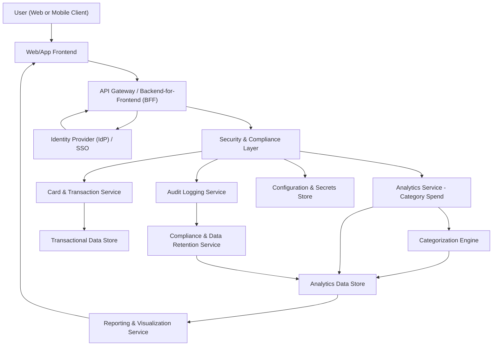

#### 1. High-Level Design

- Architecture Overview & Component Diagram:

- Component Descriptions:

  - User (Web or Mobile Client): Browser or mobile app used to access the dashboard and category-wise analytics.
  - Web/App Frontend:
    - Renders category-wise spend charts (bar, pie, line).
    - Provides filters for date ranges, card selection, and category filters.
    - Invokes backend APIs for aggregated category spend data.
  - API Gateway / Backend-for-Frontend (BFF):
    - Provides REST/GraphQL endpoints tailored for the dashboard.
    - Handles request routing, coarse-grained authorization, throttling, and input validation.
  - Analytics Service - Category Spend:
    - Aggregates transaction data by category.
    - Computes per-category totals, percentages, and cross-card summaries.
    - Supports time-window queries (e.g., monthly, custom ranges).
  - Card & Transaction Service:
    - Exposes card and transaction data (masked card identifiers, transaction amounts, timestamps).
    - Provides enriched transaction records with category codes or IDs.
  - Categorization Engine:
    - Maps transactions to predefined categories: Food & Dining, Fuel, Shopping, Travel, Entertainment, Utilities, Healthcare, Education, Miscellaneous.
    - Provides rules-based classification (merchant code, MCC, description patterns).
    - Ensures consistent category tagging across all cards.
  - Reporting & Visualization Service:
    - Prepares datasets optimized for chart rendering (grouped, sorted, formatted).
    - May provide cached or pre-aggregated views for performance.
  - Security & Compliance Layer:
    - Cross-cutting layer for authN, authZ, encryption, input/output controls, and policy enforcement.
    - Implements RBAC/ABAC (e.g., users can only see their own card data).
  - Audit Logging Service:
    - Persists security, access, and administrative events.
    - Supports compliance reports (who accessed what, when).
  - Identity Provider (IdP) / SSO:
    - Provides authentication via OAuth2/OIDC (e.g., enterprise SSO).
    - Issues access tokens used by backend services.
  - Configuration & Secrets Store:
    - Manages secrets (database credentials, API keys) and configs.
  - Transactional Data Store:
    - Holds raw transaction data with minimal necessary PII.
    - Enforces data retention and encryption-at-rest.
  - Analytics Data Store:
    - Stores aggregated and denormalized datasets for category analytics.
    - May be implemented via data warehouse, OLAP, or analytics DB.
  - Compliance & Data Retention Service:
    - Enforces data retention policies and supports data lineage and reporting.
    - Coordinates deletion/anonymization of data past retention windows.

- Integration Points & Data Flow:

  1. Authentication:
     - User authenticates via Web/App Frontend.
     - Frontend redirects to IdP.
     - IdP returns a token used for secure API calls.

  2. Data Retrieval & Categorization:
     - API Gateway receives requests for category-wise spend (filters: user, date range, card selection).
     - Security & Compliance Layer validates token and authorizes user access.
     - Card & Transaction Service retrieves transactions from the Transactional Data Store for the given user and time frame.
     - Categorization Engine:
       - Applies category mapping rules to each transaction.
       - Ensures every transaction is mapped to one of the predefined categories or a “Miscellaneous” fallback.
       - Stores categorized transactions and aggregates in the Analytics Data Store.

  3. Aggregation & Analytics:
     - Analytics Service - Category Spend:
       - Aggregates spend per category across selected cards and time ranges.
       - Calculates totals and ratios (e.g., % of total spend per category).
       - Applies business rules (e.g., handle refunds, currency conversions if required).

     - Reporting & Visualization Service:
       - Structures the aggregated data into datasets suitable for charts (category label, amount, percentage).
       - Provides consistent formatting and units.

  4. Presentation:
     - Web/App Frontend:
       - Visualizes data as charts (bar/pie charts showing category distribution).
       - Supports interactions: changing period, toggling categories/cards, drilling into categories.

  5. Audit & Compliance:
     - Security & Compliance Layer:
       - Logs each access to category reports to the Audit Logging Service.
       - Enforces data access scopes and retention policies via the Compliance Service.
     - Compliance & Data Retention Service:
       - Ensures that any stored analytics records align with retention policies.
       - Provides lineage from aggregated records back to underlying transaction sources (through metadata and IDs).

- Security & Compliance Features:

  - Encryption:
    - In transit:
      - All client-server and service-service communication over TLS 1.3 with strong cipher suites.
    - At rest:
      - Transactional and analytics data stores encrypted using AES-256.
      - Keys managed via an enterprise-grade key management system (KMS).
  - Input Validation:
    - API Gateway validates all incoming requests:
      - User IDs, card IDs, date ranges, and category filters checked against whitelists, regex patterns, and range constraints.
      - Prevents injection attacks and malformed filter criteria.
  - Output Filtering:
    - Responses:
      - Do not expose full card numbers, only masked identifiers and non-sensitive metadata.
      - PII fields either omitted or masked according to policy.
    - Role-specific views:
      - Admin/Support views enforce stricter redaction than user views, as required.
  - RBAC/ABAC:
    - Role-based: User, Admin, Support roles, with least-privilege access.
    - Attribute-based:
      - Policies based on attributes such as user ID, tenant, region, data classification, and legal constraints.
      - Enforces that users only see their own cards’ category analytics.
  - Audit Logging:
    - Every access to category analytics logged with:
      - User ID (or pseudonymized ID), timestamp, resource, operation (view/report), and filters applied.
    - Logs stored in a tamper-evident storage with retention policies aligned to compliance requirements.
  - Secrets Management:
    - Secrets stored in Configuration & Secrets Store:
      - Rotated regularly.
      - Access limited to services via least-privilege tokens.
  - Compliance:
    - Data Retention:
      - Analytics data aligned with defined retention periods, beyond which data is anonymized or deleted.
    - Consent Management:
      - System ensures that analytics features operate only for users who have given required consents for usage analytics.
      - Consent statuses stored and enforced by Compliance & Data Retention Service.
    - Data Lineage:
      - Each analytics record includes references to source systems and data sets.
      - Enables reconstruction of how category metrics were derived for audits.
    - Compliance Reporting:
      - Predefined queries on audit logs and lineage data for regulatory reporting.

- Resiliency & Error Handling:

  - Circuit Breakers:
    - Between API Gateway and downstream services (Card & Transaction, Analytics, Categorization).
    - Prevents cascading failures if a downstream service becomes unavailable.
  - Retries:
    - Idempotent read operations (fetching transaction/analytics data) retried with exponential backoff.
    - Retry policies respect SLAs and avoid overloading dependencies.
  - Timeouts:
    - Strict timeouts on backend calls to ensure the UI does not hang.
  - Fallbacks:
    - If analytics store unavailable, system may:
      - Return last cached category distribution with clear timestamp metadata, or
      - Gracefully inform the user that analytics are temporarily unavailable.
  - Logging:
    - Structured logs for:
      - API requests and responses (partial).
      - Errors and performance metrics.
    - Logs integrated with monitoring and alerting tools (e.g., latency, error rates).
  - Graceful Degradation:
    - If category analytics fails, dashboard still loads core KPIs and card lists.
    - Category charts can be hidden or replaced with a generic error card.

#### 2. Validation Report

- Requirements Coverage:

  - Category classification of transactions:
    - Categorization Engine ensures classification into the listed categories plus Miscellaneous.
  - Category-wise spend aggregation:
    - Analytics Service aggregates and stores per-category spend across cards and time ranges.
  - Visualizations per category (charts):
    - Reporting & Visualization Service plus Web/App Frontend deliver interactive category charts.
  - Cross-card category summaries:
    - Analytics Service supports aggregation across multiple cards by user.
  - Ability to view category distribution for a given period:
    - Filters for date ranges at API and UI layers; queries restricted to selected periods.
  - Support for listed categories:
    - Engine rules define Food & Dining, Fuel, Shopping, Travel, Entertainment, Utilities, Healthcare, Education, Miscellaneous as standard categories.
  - NFRs:
    - Performance:
      - Use of analytics store with pre-aggregations and caching for responsive visualizations.
      - Tested to ensure typical transaction volumes meet render time thresholds.
    - Security:
      - Encryption, RBAC/ABAC, audit logging as described above.
    - UI Responsiveness:
      - Frontend rendering focused on lightweight data sets and lazy loading.

- Compliance Status:

  - Data Retention:
    - Analytics data retention controlled by Compliance & Data Retention Service; past-retention data anonymized or deleted.
    - PASS, subject to correct configuration of retention durations.
  - Privacy Constraints:
    - No raw card PANs exposed; masked identifiers only.
    - PII minimized in analytics; access governed by RBAC/ABAC.
    - Audit logs and lineage maintained for regulatory visibility.
    - Consent checks applied before computing or displaying analytics.
    - PASS, pending privacy review sign-off.

- Identified Ambiguities/Risks:

  - Ambiguity: Treatment of refunds and charge reversals in category aggregation.
    - Mitigation: Business rules in Analytics Service to handle negative transactions and adjust category totals accordingly.
  - Ambiguity: Handling multi-currency transactions.
    - Mitigation: Introduce standardized currency conversion rules or restrict MVP to single-currency; flagged for product decision.
  - Risk: Misclassification of categories due to merchant code inconsistencies.
    - Mitigation: Rule refinement and periodic quality checks; allow manual correction workflows in later releases.
  - Risk: Performance degradation with very high transaction volumes.
    - Mitigation: Use analytics store optimized for OLAP queries; introduce caching and index tuning; monitor performance metrics.
  - Risk: Consents or legal requirements varying by jurisdiction.
    - Mitigation: ABAC policies incorporating region/jurisdiction attributes; ensure configuration-driven policies that can be updated without code changes.
