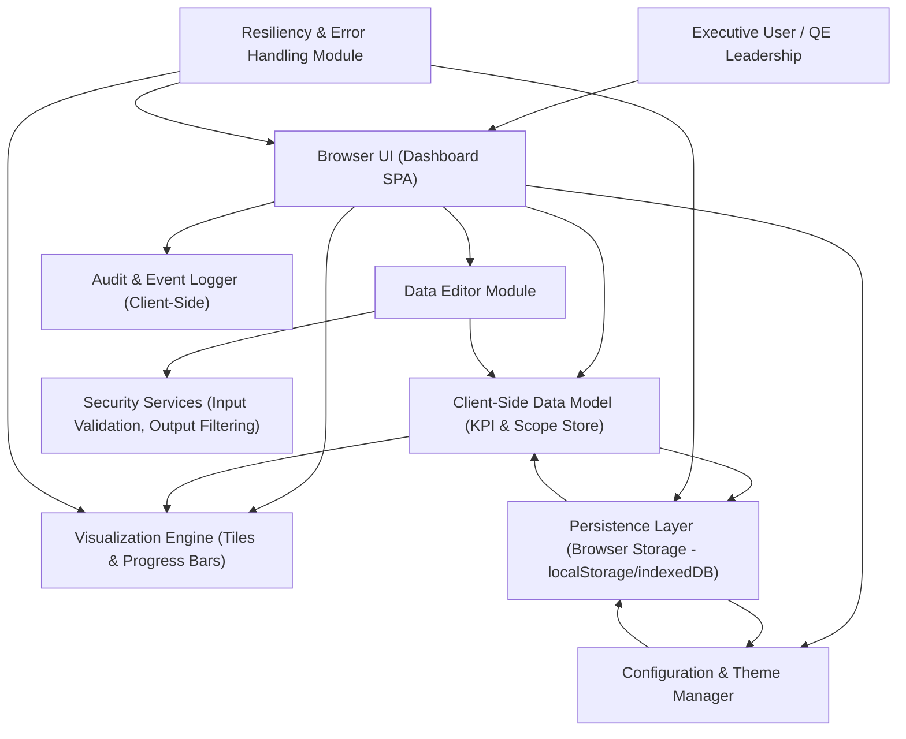

#### 1. High-Level Design

- Architecture Overview & Component Diagram:

- Component Descriptions:

  - Browser UI (Dashboard SPA): Single-page web application that renders executive KPI tiles, testing scope tiles, agentification progress, workflows, APB flows, and use case readiness via HTML/CSS/JS.
  - Client-Side Data Model (KPI & Scope Store): In-memory representation of KPIs, testing scopes, statuses, ETAs, and planned completion dates; acts as the single source of truth in the client.
  - Data Editor Module: Controlled input forms/tables for editing KPIs, testing scope values, statuses (In Progress, Design in Progress), agentification ETAs, and planned completion dates without editing HTML.
  - Visualization Engine (Tiles & Progress Bars): Renders KPI tiles, scope tiles, progress bars, and groupings; recalculates and redraws visuals when data changes.
  - Persistence Layer (Browser Storage): Uses localStorage and/or indexedDB to persist dashboard data, statuses, ETAs, and visual configuration so state survives refresh on the same browser/device.
  - Security Services (Input Validation, Output Filtering): Client-side validators and sanitizers enforcing numeric formats, date formats, status enums, and preventing injection in labels/text.
  - Audit & Event Logger (Client-Side): Logs significant user actions (e.g., data edits, theme changes) in memory and optionally in browser storage for traceability within the session.
  - Configuration & Theme Manager: Manages visual configuration (colors, groupings, layouts) and ensures contrast and readability constraints are enforced.
  - Resiliency & Error Handling Module: Centralized error handler for storage failures, rendering issues, and validation errors; manages user notifications and fallback behaviors.

- Integration Points & Data Flow:

  - User Interaction:
    - Executive user opens the dashboard in a browser.
    - Browser UI initializes by loading persisted state from the Persistence Layer into the Client-Side Data Model.
    - Visualization Engine renders tiles and progress bars from the in-memory data.

  - Data Editing:
    - User edits KPI values, testing scope counts, status indicators, ETAs, or planned completion dates using the Data Editor Module.
    - Security Services validate input (formats, ranges, enums) and sanitize text fields before updates.
    - Valid edits update the Client-Side Data Model, which triggers recalculation of percentages and re-rendering via the Visualization Engine.

  - Persistence:
    - On data change, the Persistence Layer serializes the current state (KPIs, scopes, statuses, ETAs, visual groupings) to localStorage/indexedDB.
    - On next page load, dashboard initialization reads the stored state; if unavailable or corrupted, falls back to default configuration and seed data.

  - Grouping and Visualization:
    - The Data Model maintains per-scope attributes: type (sprint, regression, etc.), status (In Progress, Design in Progress), agentification ETA, and completion metrics.
    - Visualization Engine groups scopes visually by status (In Progress vs. Design in Progress) and renders progress bars and readiness indicators accordingly.

- Security & Compliance Features:

  - Input Validation:
    - KPI and scope counts constrained to non-negative integers or percentages (0–100).
    - Dates validated against ISO-like formats (e.g., YYYY-MM-DD) and prevented from being nonsensical (e.g., 0000-00-00).
    - Status fields restricted to controlled vocabulary (e.g., In Progress, Design in Progress, Not Started, Completed).
    - ETAs required where the scope requires agentification visibility as per requirements.

  - Output Filtering:
    - All user-entered text (labels, notes) passed through a basic sanitizer to remove or escape potentially harmful characters (e.g., scripts, HTML tags) before insertion into DOM.
    - Rendering uses textContent bindings rather than innerHTML where possible.

  - Encryption & Transport:
    - In the current release, data is stored only in browser storage; no backend database or network transport is in scope.
    - For future readiness and compliance, architecture assumes serving dashboard assets over HTTPS with TLS 1.3, ensuring secure delivery of HTML/CSS/JS.
    - If optional integration endpoints are added later (though out of scope now), AES-256 encryption for sensitive payloads at rest is to be applied and enforced via a backend service.

  - Access Control (RBAC/ABAC):
    - This epic does not introduce user authentication or backend RBAC by requirement (explicitly out of scope).
    - Design is compatible with future extension: dashboard can consume role or attribute claims from a parent application that provides RBAC/ABAC, disabling editing for view-only roles while keeping visualization read-only.

  - Audit Logging:
    - Client-side event log captures:
      - Data edits (field, previous value, new value, timestamp).
      - Theme changes and layout changes.
    - Logs stored in memory for the session; optional flag can persist recent events in browser storage.
    - Because no central server is present, these logs are not system-of-record but help local traceability.

  - Compliance Mapping:
    - Data Retention: dashboard maintains data in browser storage; retention is limited to the users browser, and items can be cleared by user action or browser clearing storage.
    - Consent & Privacy: no personal data is required for this epic; design avoids capturing PII/PHI. Any labels entered by users should be constrained to test entities, not individuals.
    - Data Lineage: since all KPI/test scope data is manually input, the dashboard surfaces a Manual Data Source banner and allows an optional free-text field where users can note origin (e.g., Data extracted from ADO on 2026-08-01).

- Resiliency & Error Handling:

  - Error Handling Patterns:
    - Centralized error handler wraps calls to Persistence Layer and Visualization Engine.
    - User-friendly messages displayed on:
      - Inability to read/write browser storage (e.g., storage quota exceeded).
      - Invalid inputs (highlighted fields with inline feedback).

  - Retries:
    - On transient storage errors (e.g., quota temporarily blocked), the system:
      - Attempts a small number of retries (e.g., 23) with short delays.
      - If failures persist, disables auto-persistence and informs user that changes will not persist.

  - Circuit Breaker:
    - If storage operations repeatedly fail, the Resiliency Module activates a lightweight circuit breaker:
      - Further storage writes are skipped for a cooldown window.
      - Dashboard continues to function with in-memory state only.
      - A non-intrusive banner informs user that persistence is currently unavailable.

  - Fallbacks:
    - When loading persisted state fails due to corruption or incompatible schema:
      - Fallback to default baseline configuration and seed KPIs.
      - Preserve original corrupted payload under a different key (if small enough) for diagnostics, without blocking operation.

#### 2. Validation Report

- Requirements Coverage:

  - Executive KPI Summary:
    - KPI tiles: supported via Visualization Engine, driven by Client-Side Data Model.
    - At-a-glance view: layout and contrast-focused design as per NFRs.

  - Testing Use Case Progress:
    - Visualization of testing scope progress: progress bars and tiles per scope reflect counts and percentages.
    - Use case readiness indicators: per-scope readiness flags rendered next to progress bars.

  - Agentification & Workflow/APB:
    - Agent progress visualization: dedicated tile sets reflect agentification status and ETAs.
    - Workflow and APB flow progress: separate tiles/groups for workflows and APB flows with progress bars.

  - Use Case Readiness & Status:
    - Testing scope status indicators: statuses mapped to visual groups and colors (e.g., In Progress vs. Design in Progress).
    - Display of "In Progress" and "Design in Progress" scopes: grouping and color coding implemented.

  - Planned Completion Dates:
    - Display of planned completion dates: optional date attributes displayed on relevant KPI or scope tiles.

  - Non-Functional Requirements:
    - Performance: architecture minimizes heavy libraries, leverages client rendering and local storage; designed to meet 2 second load under normal conditions by:
      - Lazy-loading non-essential modules.
      - Caching static assets.
    - Usability: dashboard structure and grouping optimized for minimal scroll and at-a-glance understanding.
    - Responsiveness: CSS-based responsive layout tailored for desktop, tablet, and presentation resolutions.
    - Contrast/Accessibility: Theme Manager enforces minimal contrast ratios for text and indicators (e.g., by checking foregroundbackground pairs).

- Compliance Status:

  - Data Retention:
    - Pass (for defined scope):
      - Data restricted to browser storage on the users device.
      - No backend persistence or central repository involvement.
      - Users can clear data via browser settings or a "Reset Dashboard Data" function.

  - Consent & Privacy:
    - Pass:
      - No PII/PHI required; data elements relate to tests and KPIs.
      - UI guidance tells users not to input personal names or IDs in labels.

  - Encryption & Transport:
    - Pass (for current scope):
      - Dashboard is expected to be hosted over HTTPS/TLS 1.3.
      - No at-rest data beyond browser storage; AES-256 considered for future backend integrations, but not required in this release.

  - Data Lineage & Compliance Reporting:
    - Partial Pass:
      - Manual "Data Source" note field available to capture lineage references (e.g., ADO boards, Jira filters).
      - No automated lineage tracking or compliance reporting as this is out of scope for the initial release.

- Identified Ambiguities/Risks:

  - Risk: Manual Data Accuracy:
    - Description: Dashboard relies on manual or locally stored values; risk of mismatch between executive KPIs and detailed testing scopes.
    - Mitigation:
      - Provide consistency checks (e.g., sum of scope counts vs. global KPI totals).
      - Display warnings when totals differ beyond a threshold.
      - Encourage users to capture "Last Updated" timestamps on tiles.

  - Risk: Browser Storage Limitations:
    - Description: localStorage/indexedDB quotas may be exceeded, causing persistence failures.
    - Mitigation:
      - Keep stored structure compact.
      - Implement circuit breaker and fallback behaviors described above.
      - Provide UI indication when persistence fails.

  - Risk: Theme Customization Affecting Readability:
    - Description: Users can select themes that damage contrast and readability for executive users.
    - Mitigation:
      - Theme Manager enforces minimum contrast checks.
      - Provide accessible preset themes optimized for presentations.
      - Warn users when chosen colors violate contrast guidelines.

  - Risk: No Centralized Audit:
    - Description: Only client-side logging is possible without a backend; limited forensic capability.
    - Mitigation:
      - Clearly document limitation.
      - For regulated environments, recommend deployment behind an authenticated, centrally logged wrapper application if needed in future phases.

  - Risk: Future Integrations:
    - Description: Epic states out-of-scope features like backend DB, real-time Jira/ADO integration, and enterprise reporting; adding these later may impact security and compliance posture.
    - Mitigation:
      - Current design anticipates a secure backend integration layer.
      - Document extension points for secure APIs (TLS 1.3, AES-256, RBAC/ABAC) so future changes are well-scoped and reviewable.
