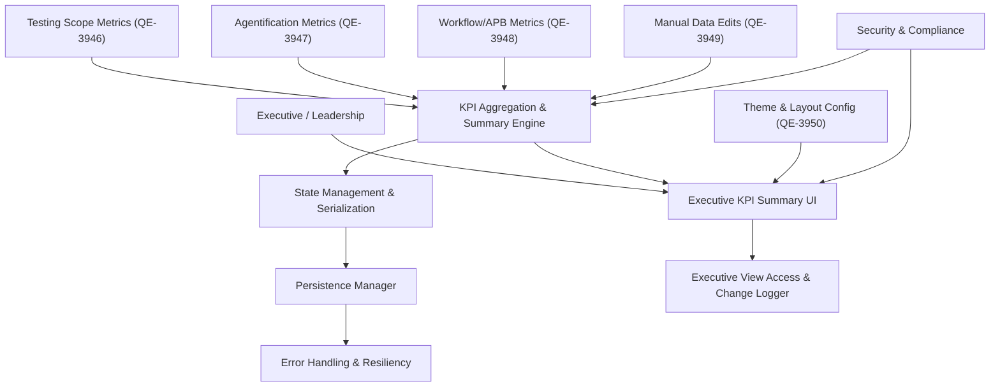

#### 1. High-Level Design

- Architecture Overview & Component Diagram:

- Component Descriptions:

  - Executive KPI Summary UI: High-level tiles and visual indicators summarizing program health, including testing progress, workflow/APB, agentification, and planned completion dates.
  - KPI Aggregation & Summary Engine: Aggregates metrics from other epics into a coherent overview (e.g., overall completion %).
  - Metrics Sources: Each contributing epic provides its metrics.
  - State Management & Persistence: Maintains overall KPIs and simple summary configuration.
  - Security & Compliance: Ensures summary view does not expose sensitive information; controls who can see what level of detail.
  - Executive View Logger: Logs access and configuration changes for governance.

- Integration Points & Data Flow:

  1. Aggregation:
     - Engine pulls metrics from scope, agentification, workflow/APB, and manual data editing modules.
     - Computes overall progress and summary KPIs.
  2. Presentation:
     - KPIs rendered in summary UI; uses theme configuration for consistent styling.
  3. Persistence:
     - Key summary settings persisted; underlying data held by respective epics’ persistence.

- Security & Compliance Features:

  - RBAC/ABAC:
    - Executive view may show only aggregated metrics; more granular data restricted by role.
  - Compliance:
    - Focus on aggregated KPIs; minimal privacy concerns.
  - TLS 1.3:
    - Any optional remote integration for executive reports uses TLS 1.3.

- Resiliency & Error Handling:

  - Missing Data Sources:
    - If any source metrics unavailable, show partial data with clear indicators; avoid blocking entire dashboard.
  - Aggregation Errors:
    - Defaults to conservative values; logs anomalies.

#### 2. Validation Report

- Requirements Coverage:

  - Single executive view of overall testing program: Achieved via KPI Summary UI and Aggregation.
  - Completed vs pending counts; progress percentages: Derived from integrated metrics.
  - High-level testing scope status, workflow, APB, agentification, ETAs: all integrated from other epics.
  - Planned completion dates display: Derived from ETAs and summary fields.

- Compliance Status:

  - Data Retention & Privacy:
    - Aggregated data only; minimal risk.
    - Status: Pass.
  - Governance:
    - Optional logging of executive access helps with audit trails.
    - Status: Pass.

- Identified Ambiguities/Risks:

  - Ambiguity: Exact composition of "overall" KPI (weighted vs simple average).
    - Mitigation: Document and standardize aggregation rules; align with governance decisions.
  - Risk: Misinterpretation if some sources stale or missing.
    - Mitigation: Staleness indicators and clear metadata (last updated timestamps).

