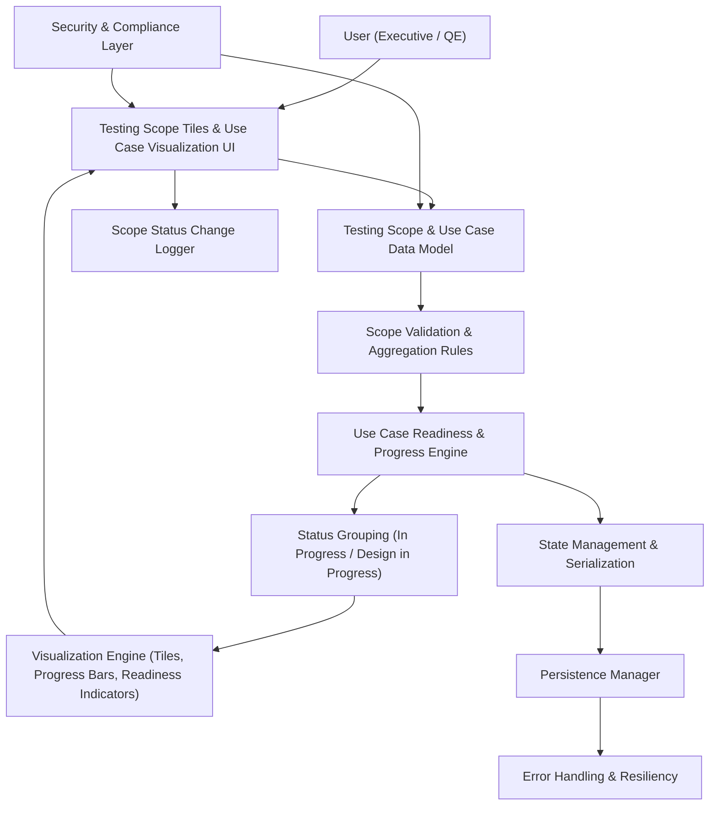

#### 1. High-Level Design

- Architecture Overview & Component Diagram:

- Component Descriptions:

  - Testing Scope & Use Case Data Model: Represents each testing scope (Sprint, Regression, API, UI, etc.), with counts of completed/pending use cases and statuses.
  - Scope Validation & Aggregation: Enforces valid counts and aggregates across scopes as needed.
  - Use Case Readiness & Progress Engine: Calculates per-scope percentages and readiness indicators.
  - Status Grouping: Classifies scopes into "In Progress", "Design in Progress", or other statuses and groups their tiles.
  - Visualization Engine: Renders tiles, progress bars, and readiness indicators in a single layout.
  - State Management & Persistence: Stores counts, statuses, and groupings across refreshes.
  - Security & Compliance Layer: Ensures only high-level metrics stored; avoids deeper test details.
  - Scope Status Change Logger: Logs significant changes for governance.

- Integration Points & Data Flow:

  1. Data Input:
     - Values entered via Data Editing UI; persistence integrated with QE-3951.
  2. Calculation:
     - Engine computes readiness and progress for each scope; updates Visualizations.
  3. Grouping:
     - Grouping module organizes tiles into sections for "In Progress" and "Design in Progress" as required.
  4. Persistence:
     - Counts, statuses, and grouping persisted across sessions.

- Security & Compliance Features:

  - Input Validation:
    - Ensure data integrity; clamp or reject invalid counts.
  - RBAC:
    - Editing restricted; viewing open to broader roles.
  - Compliance:
    - Data limited to aggregated scope metrics; no test-level sensitive data.

- Resiliency & Error Handling:

  - Data Integrity Failures:
    - Fallback to last-known-good or highlight issues without breaking UI.
  - Persistence Issues:
    - Fallback patterns as for other epics.

#### 2. Validation Report

- Requirements Coverage:

  - Tiles for all defined testing scopes: Included in Data Model and Visualization.
  - Completed vs pending counts: Captured and displayed with progress bars.
  - Use case readiness indicators: Provided by Readiness Engine.
  - In Progress and Design in Progress status display: Implemented via Status Grouping module.
  - NFRs: Designed for clarity at-a-glance; responsive and consistent with global NFRs.

- Compliance Status:

  - Data Retention & Privacy:
    - Scope-level metrics only; complies with policies.
    - Status: Pass.
  - Accessibility:
    - Collaboration with Theme epic ensures contrast and readability.
    - Status: Pass.

- Identified Ambiguities/Risks:

  - Ambiguity: Exact readiness thresholds (e.g., what percentage counts as "ready").
    - Mitigation: Document thresholds and allow configuration.
  - Risk: Overcrowded UI if all scopes shown at once.
    - Mitigation: Grouping and layout tuning; potential for filters.

