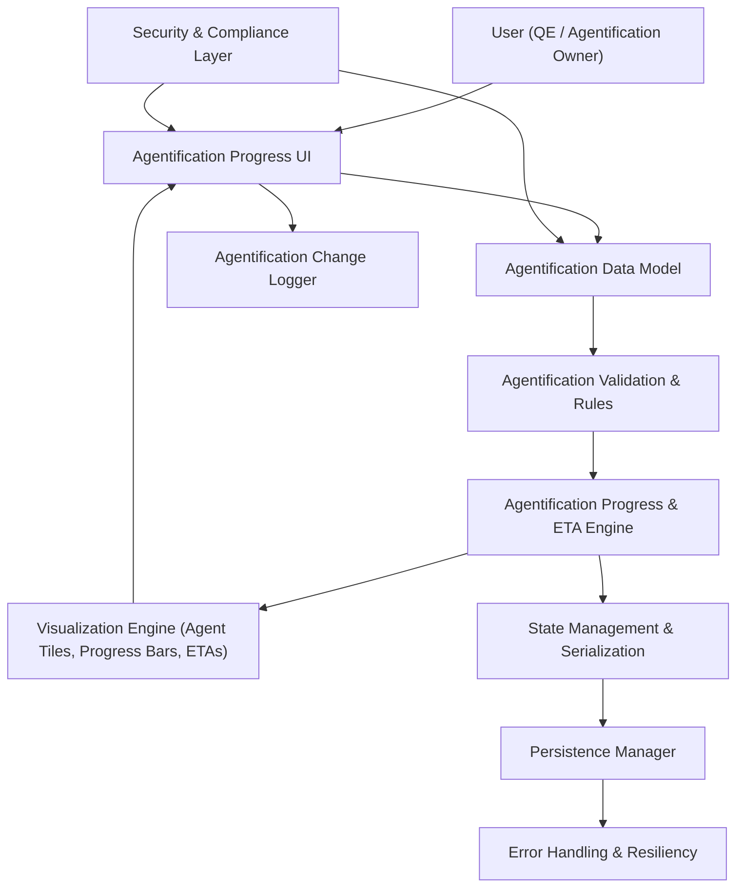

#### 1. High-Level Design

- Architecture Overview & Component Diagram:

- Component Descriptions:

  - Agentification Progress UI: Displays per-testing-scope agentification percentages and ETAs.
  - Agentification Data Model: Entities for each testing scope with fields for total tests, agentified tests, and ETA.
  - Validation & Rules: Ensures ETAs are valid dates, progress between 0–100%, and totals consistent.
  - Progress & ETA Engine: Computes percentages and normalizes ETA display; integrates with overall KPI engine.
  - Visualization Engine: Renders progress bars and tiles with simple, glanceable designs.
  - State Management & Persistence: Manages and persists agentification metrics across sessions.
  - Security & Compliance Layer: Ensures only non-sensitive metrics persisted; ETAs do not expose personal schedules.
  - Change Logger: Logs major shifts in agentification (e.g., crossing thresholds such as 50%, 75%).

- Integration Points & Data Flow:

  1. Data Capture:
     - Agentification metrics entered via Data Editing UI (QE-3949).
     - Validation ensures consistency.
  2. Calculation:
     - Progress Engine calculates per-scope percentages; passes to Executive KPI Summary.
  3. Visualization:
     - UI renders tiles/bars with ETAs for each scope.
  4. Persistence:
     - Stored via shared Persistence Manager, ensuring values survive refresh.

- Security & Compliance Features:

  - Input Validation:
    - ETAs must be in acceptable format and within defined timeframe bounds.
  - RBAC:
    - Only certain roles allowed to edit agentification metrics.
  - Compliance:
    - ETAs treated as high-level project dates, not personal schedules; minimal privacy risk.
  - Transport Security:
    - Any remote configuration/telemetry uses TLS 1.3; sensitive details not transferred.

- Resiliency & Error Handling:

  - Invalid ETAs:
    - Fallback to "Unknown" or last-known-valid; log issue.
  - Calculation Failures:
    - Default to 0% or previous value; avoid blocking the dashboard.

#### 2. Validation Report

- Requirements Coverage:

  - Agent progress visualization per testing scope: Supported via Agentification Data Model and Visualization Engine.
  - ETAs per testing scope: Captured and displayed.
  - Inclusion within executive KPIs: Integrated into main KPI and dashboard layout.
  - Persistence across refresh: Covered by integration with Persistence Manager.

- Compliance Status:

  - Data Retention:
    - Non-sensitive metrics; standard retention policy.
    - Status: Pass.
  - Privacy:
    - No personal schedule/identity data; scope-level ETAs only.
    - Status: Pass.

- Identified Ambiguities/Risks:

  - Ambiguity: How precise ETAs must be (day vs week vs sprint).
    - Mitigation: Standardize on a unit (e.g., date or week); define in UX.
  - Risk: Outdated ETAs causing misalignment.
    - Mitigation: Highlight stale data (e.g., ETAs older than current date); prompt updates.

