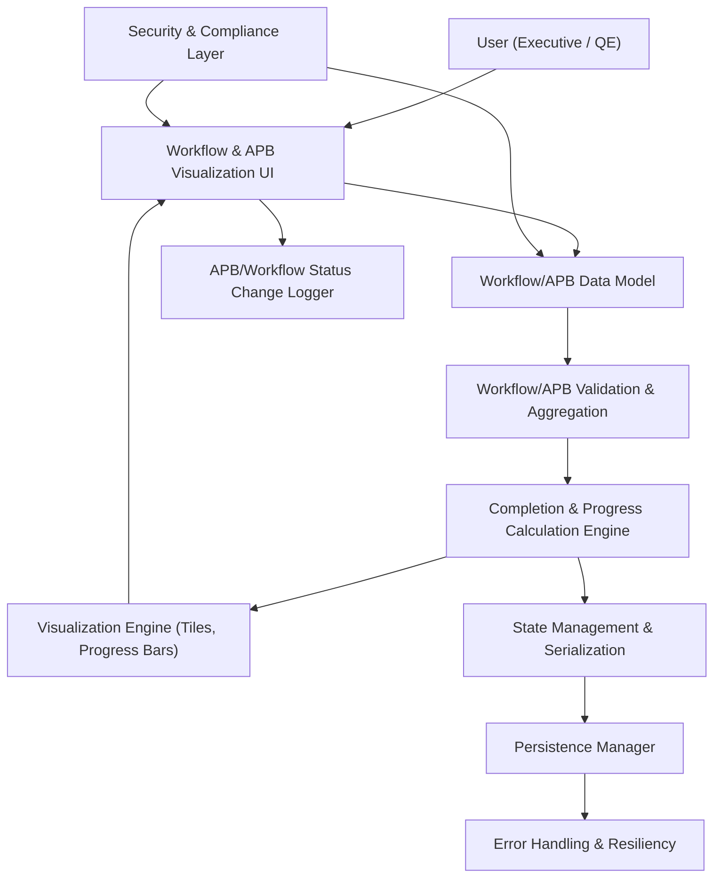

#### 1. High-Level Design

- Architecture Overview & Component Diagram:

- Component Descriptions:

  - Workflow & APB Visualization UI: Tiles, charts, and progress indicators for workflow and APB completion.
  - Workflow/APB Data Model: Defines entities for workflows/APB flows, including total steps, completed steps, and statuses.
  - Validation & Aggregation: Enforces valid state (e.g., completed ≤ total), aggregates by flow type or category.
  - Completion & Progress Calculation Engine: Computes completion percentages for each flow and overall summary.
  - Visualization Engine: Maps calculated metrics into UI widgets and ensures clear interpretability.
  - State Management & Persistence Manager: Manage and persist workflow/APB data via browser storage.
  - Security & Compliance Layer: Ensures that workflow/APB data is appropriate for local persistence and viewing.
  - Status Change Logger: Logs significant changes to completion metrics (aggregated; no PII).
  - Error Handling & Resiliency: Manages inconsistent data, persistence failures, and rendering issues.

- Integration Points & Data Flow:

  1. Data entry or import:
     - Workflow/APB counts are entered via Data Editing UI (QE-3949) or pre-configured.
     - Data Model stores them; Validation & Aggregation verifies integrity.
  2. Computation:
     - Progress Calculation Engine converts raw counts into completion percentages and statuses.
  3. Visualization:
     - Visualization Engine produces tiles and bars; results integrated into Executive KPI Summary.
  4. Persistence:
     - State Management and Persistence Manager maintain state across sessions, integrated with overall persistence design.

- Security & Compliance Features:

  - Input Validation:
    - Basic constraints on counts and statuses; ensures no injection in names or labels.
  - RBAC:
    - Editing of workflow/APB metrics restricted to authorized users; view-only roles for executives.
  - Encryption & TLS:
    - If workflow/APB metrics synchronized with a remote source, communications must use TLS 1.3 and, if required, AES-256 encryption for payloads at rest.
  - Audit Logging:
    - Significant status changes logged, useful for governance; logged at aggregate level without exposing detailed flow information.
  - Compliance:
    - Data captured is high-level execution/coverage metrics; minimal privacy risk.
    - Retention follows general dashboard policy.

- Resiliency & Error Handling:

  - Inconsistent Data:
    - If completed > total, clamp values and log anomaly; prompt user to correct.
  - Persistence Failures:
    - Use general persistence resiliency patterns; fallback to in-memory view.

#### 2. Validation Report

- Requirements Coverage:

  - Workflow and APB progress visualization: Supported via dedicated UI and Visualization Engine.
  - Progress bars and status tiles: Included.
  - Inclusion in executive KPIs: Integrated with Executive KPI Summary epic and layout.
  - Completed vs pending counts: Captured in data model and displayed.

- Compliance Status:

  - Data Retention & Privacy:
    - High-level metrics only; no personal identifiers.
    - Status: Pass.
  - Security:
    - Optional remote integrations require TLS 1.3; no sensitive data persisted unencrypted.
    - Status: Pass.

- Identified Ambiguities/Risks:

  - Ambiguity: Granularity of workflow/APB breakdown.
    - Mitigation: Start with high-level aggregated flows; refine with future stories.
  - Risk: Misalignment with upstream workflow tools (out-of-scope integration).
    - Mitigation: Clearly note that data is manually maintained; avoid implying live sync.

