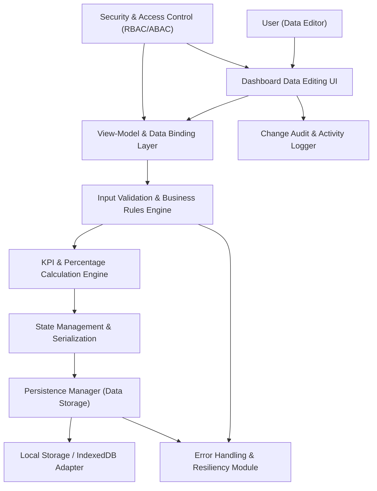

#### 1. High-Level Design

- Architecture Overview & Component Diagram:

- Component Descriptions:

  - Dashboard Data Editing UI: Structured forms/controls to edit testing data, KPI values, statuses, ETAs, etc.
  - View-Model & Data Binding Layer: Connects UI fields to internal state; ensures changes propagate to calculations.
  - Input Validation & Business Rules Engine: Validates inputs (ranges, formats, required fields) and enforces domain constraints (e.g., completed ≤ total).
  - KPI & Percentage Calculation Engine: Recalculates counts, percentages, and progress bars on any edit.
  - State Management & Serialization: Maintains consistent in-memory representation of data and serializes to JSON.
  - Persistence Manager: Saves validated data using browser storage; integrates with overall persistence epic.
  - Security & Access Control: Ensures only authorized roles (if available) can edit data; read-only users see but cannot change values.
  - Change Audit & Activity Logger: Logs significant edits (e.g., KPI changes, status changes, ETA adjustments).
  - Error Handling & Resiliency Module: Handles validation failures, calculation errors, and storage issues gracefully.

- Integration Points & Data Flow:

  1. Editing workflow:
     - User edits fields in UI; VM updates data model.
     - Validation Engine checks values; errors returned inline.
     - On valid input, Calculation Engine recalculates derived values and updates VM.
  2. Persistence:
     - State Management serializes validated data and passes to Persistence Manager.
     - Persistence Manager stores under versioned schema keys.
  3. Visualization:
     - Recalculated KPIs and progress bars bound to UI; changes reflect instantly.
  4. Integrations:
     - Tightly integrated with persistence (QE-3951) and visualization epics (QE-3946/QE-3945).

- Security & Compliance Features:

  - Input Validation:
    - Strict typing for numeric and date fields; invalid entries rejected with user-friendly messages.
    - Range checks (0 ≤ completed ≤ total; ETAs must be future-dated).
  - RBAC/ABAC:
    - Editor mode restricted by role/attribute; if no identity available, editing may be controlled via environment switch.
  - Audit Logging:
    - Logs changes in aggregated form; e.g., "Regression completed from 25 to 30"; avoids storing PII.
  - Encryption & TLS:
    - Any remote synchronization or logging endpoints accessed via TLS 1.3; sensitive tokens encrypted (AES-256) if cached.
  - Compliance:
    - No sensitive testing details or PII stored locally; focus on aggregated counts and statuses.
    - Data lineage tracked via versioned schemas and explicit change logs when exported.

- Resiliency & Error Handling:

  - Validation Failures:
    - Prevent persistence; highlight fields; preserve last-known-good values.
  - Calculation Errors:
    - Catch divide-by-zero or missing totals; default to safe 0% and log warning.
  - Storage Failures:
    - Use circuit breaker and fallbacks as defined in persistence epic; inform user if persistence unavailable.

#### 2. Validation Report

- Requirements Coverage:

  - Direct browser-based data editing without HTML/source changes: Covered via Data Editing UI and View-Model layer.
  - Editable fields for KPIs, testing data, statuses, ETAs: Supported in data schema.
  - Automatic recalculation of progress and percentages: Provided by KPI & Percentage Calculation Engine.
  - Validation to reduce incorrect manual entry: Provided by Validation & Business Rules Engine.
  - Immediate UI updates: Binding ensures near real-time reflection of changes.
  - Persistence across refresh: Integration with Persistence Manager ensures retained edits.

- Compliance Status:

  - Data Retention:
    - Only non-PII numeric/status fields stored; retention configurable.
    - Status: Pass.
  - Privacy:
    - No PII or sensitive defect details; high-level counts only.
    - Status: Pass.
  - Governance:
    - Optional audit logging provides traceability for critical changes.
    - Status: Pass.

- Identified Ambiguities/Risks:

  - Ambiguity: Level of detail to persist (e.g., per-scope vs aggregated KPIs).
    - Mitigation: Start with per-scope aggregated counts; keep granularity aligned with PRD.
  - Risk: Manual data entry errors causing inconsistencies.
    - Mitigation: Strong validation rules, defaulting, and summary consistency checks (totals match sum of scopes).
  - Risk: Users interpreting edited values as system-of-record data.
    - Mitigation: Clear labeling that dashboard is a presentation layer; not an authoritative repository.

