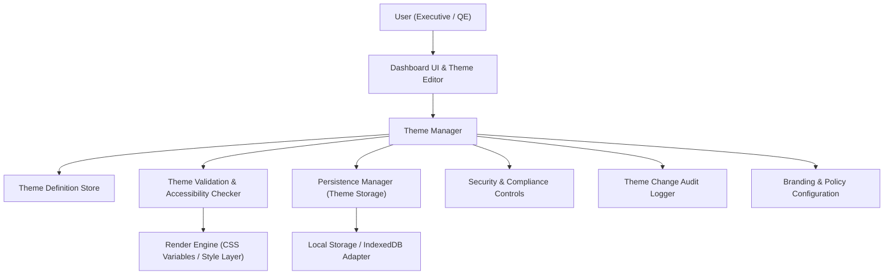

#### 1. High-Level Design

- Architecture Overview & Component Diagram:

- Component Descriptions:

  - Dashboard UI & Theme Editor: Provides UI for selecting colors, applying presets, saving/resetting themes, and previewing changes in real time.
  - Theme Manager: Central orchestrator for theme state; translates user choices into canonical theme definitions.
  - Theme Definition Store: Structured model for theme entities (overall theme, KPI tile colors, testing scope tile colors, status colors, group backgrounds).
  - Theme Validation & Accessibility Checker: Validates color combinations for contrast and readability; enforces enterprise branding constraints.
  - Persistence Manager (Theme Storage): Stores theme definitions via browser storage, integrated with HLD for persistence epic.
  - Security & Compliance Controls: Ensures theming does not leak sensitive data, respects branding regulations, and prevents unsafe dynamic styles.
  - Theme Change Audit Logger: Captures theme changes (e.g., theme IDs, timestamps, user/role if available) for traceability.
  - Branding & Policy Configuration: Encodes brand palettes, restricted palettes, and governance rules (e.g., disallowing certain colors).
  - Render Engine (CSS Variables / Style Layer): Applies validated theme values to CSS variables or style objects for instant UI updates.

- Integration Points & Data Flow:

  1. Theme editing:
     - User selects colors for dashboard theme, KPI tiles, testing scopes, statuses, and group backgrounds in UI.
     - UI sends changes to Theme Manager.
     - Theme Manager updates Theme Definition Store and runs validation via Theme Validation & Accessibility Checker.
     - If validation passes, Render Engine applies new theme (CSS variables) in real time.
  2. Theme persistence:
     - Theme Manager passes validated theme to Persistence Manager.
     - Persistence Manager stores the theme with versioned keys.
  3. Theme loading:
     - On load, Theme Manager retrieves stored theme via Persistence Manager.
     - Theme Validation & Accessibility Checker re-validates stored theme; invalid themes revert to default or closest valid configuration.
     - Render Engine applies the final theme.
  4. Launch controls & compliance:
     - Branding Configuration limits palette options to pre-approved corporate colors where required.
     - Audit Logger records changes including theme ID, timestamp, and optional role/tenant.

- Security & Compliance Features:

  - RBAC/ABAC:
    - Theme editing features can be restricted to certain roles (e.g., admin/editor) if integrated with enterprise identity.
    - ABAC rules can restrict access based on context (e.g., environment, tenant).
  - Input Validation:
    - Only accepts colors in approved formats (hex, RGB); rejects arbitrary CSS or scripts.
    - Enforces constraints on number of custom themes to avoid storage abuse.
  - Output Filtering:
    - Rendering layer only uses sanitized, validated palette values; prevents injection of arbitrary CSS/JS from stored theme data.
  - Audit Logging:
    - Theme change events logged with theme identifiers and high-level metadata; no PII required.
  - Compliance:
    - Accessibility: Automated WCAG-based contrast check for primary text/background combinations.
    - Data retention: Only non-personal theme configuration stored; retention rules applied if per-user themes are later introduced.
    - TLS 1.3: Any remote branding configuration or audit endpoint uses TLS 1.3.
    - Encryption: If themes ever contain confidential branding information, encryption at rest in browser storage can be applied (AES-256).

- Resiliency & Error Handling:

  - Circuit Breakers:
    - If a theme repeatedly fails accessibility or validation checks, prevent re-application and reset to a safe default, logging the failure.
  - Retry Mechanisms:
    - On transient storage issues, retry storing theme definitions; on repeated failure, warn user that theme is temporary.
  - Fallback Patterns:
    - Default theme applied when stored theme invalid or unavailable.
    - If validation service or rules not loaded yet, apply safe base theme until full validation available.

#### 2. Validation Report

- Requirements Coverage:

  - Theme editor interface: Modeled via Dashboard UI & Theme Editor and Theme Manager.
  - Overall dashboard theme configuration: Supported via Theme Definition Store and Render Engine.
  - Individual KPI/testing scope tile colors: Modeled in Theme Definition Store with separate fields.
  - Editable status colors and group background colors: Included as separate dimension in theme model.
  - Apply same color across all KPI/testing scope tiles: Handled by Theme Manager bulk operations.
  - Save/reset theme: Persistence Manager supports save; Theme Manager supports reset to defaults.
  - NFRs: Instant application and ≤2s load supported by lightweight theme store and CSS-variable-based render.

- Compliance Status:

  - Data Retention:
    - Only stores theme configs; no user identity required.
    - Retention optional and configurable; default is long-lived but strictly non-sensitive.
    - Status: Pass.
  - Accessibility & Brand Compliance:
    - Automated contrast checks, restricted palettes and branding config ensure compliance with corporate guidelines.
    - Status: Pass (assuming brand rules configured).
  - Security:
    - No arbitrary CSS/JS stored; only color values from approved formats.
    - Status: Pass.

- Identified Ambiguities/Risks:

  - Ambiguity: Whether themes are per-user, per-tenant, or global.
    - Mitigation: Introduce configuration flag; default to global per-browser for MVP.
  - Risk: Users selecting visually confusing color combinations despite passing minimum contrast.
    - Mitigation: Provide pre-approved presets; limit user-defined combinations; UX preview indicates readability.
  - Risk: Excessive storage use with multiple custom themes.
    - Mitigation: Cap number of saved themes; older ones purged per policy.

