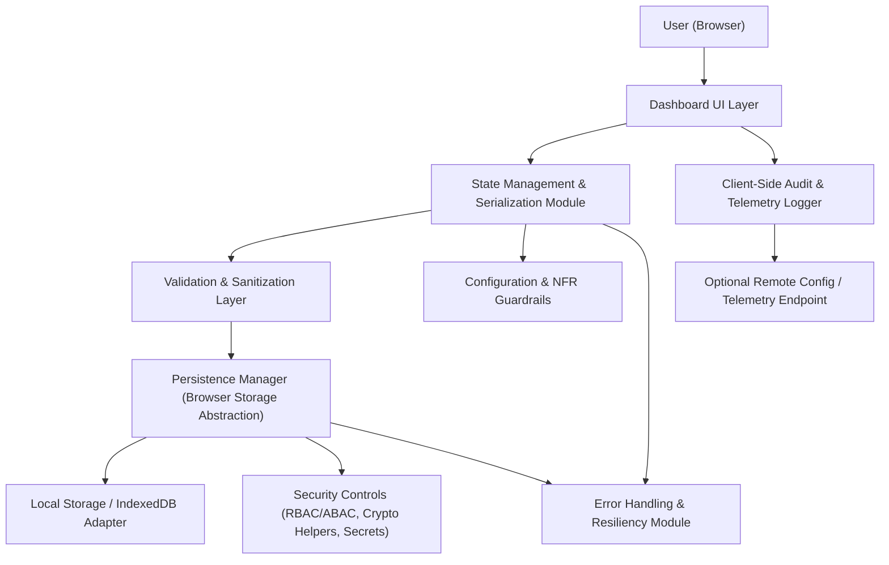

#### 1. High-Level Design

- Architecture Overview & Component Diagram:

- Component Descriptions:

  - Dashboard UI Layer: Renders KPI tiles, testing scope tiles, agentification, and theme settings; initiates save/load of state.
  - State Management & Serialization Module: Maintains in-memory dashboard state, converts it to/from a compact, versioned JSON representation.
  - Persistence Manager (Browser Storage Abstraction): Provides a unified API over localStorage/IndexedDB/sessionStorage with quotas and feature detection.
  - Validation & Sanitization Layer: Validates dashboard state before persistence; trims, normalizes, and sanitizes values to prevent injection or malformed state.
  - Security Controls: Handles secure configuration (e.g., keys or tokens if any remote telemetry/config is used), RBAC/ABAC enforcement on client features, and cryptographic helpers.
  - Client-Side Audit & Telemetry Logger: Logs state load/save events, errors, and important user actions for troubleshooting and compliance reporting (where appropriate).
  - Configuration & NFR Guardrails: Encapsulates performance budgets (≤2s load), storage quotas, and feature flags for persistence strategies.
  - Local Storage / IndexedDB Adapter: Concrete implementation of browser storage; abstracts differences between storage APIs.
  - Optional Remote Config / Telemetry Endpoint: Optional channel to fetch configuration or send anonymized telemetry in compliant environments.
  - Error Handling & Resiliency Module: Centralized error handler; orchestrates retries, fallbacks (e.g., disable persistence on repeated failure), and user-facing error messages.

- Integration Points & Data Flow:

  1. On dashboard load:
     - UI Layer initializes and requests state from State Management.
     - State Management invokes Persistence Manager.
     - Persistence Manager reads from Local Storage / IndexedDB using a namespace and schema version.
     - Validation Layer verifies stored data (schema, ranges, enums); invalid data triggers fallback to defaults.
     - Clean, validated state is returned to State Management and bound to UI components.
  2. On user changes (KPI values, testing scope status, agentification, ETAs, theme):
     - UI updates State Management.
     - State Management triggers serialization to JSON with versioning.
     - Validation & Sanitization Layer ensures fields are complete, within bounds, and sanitized.
     - Persistence Manager writes to Local Storage / IndexedDB with quotas and error handling.
  3. On storage limit / errors:
     - Error Handling Module intercepts errors (QuotaExceededError, synchronous failures).
     - Depending on policy, it either:
       - Switches to a more compact schema,
       - Disables persistence for low-priority fields (e.g., telemetry),
       - Or falls back to session-only persistence.
     - User receives non-technical message indicating limited persistence.
  4. Security & compliance:
     - Sensitive attributes (if any) are either excluded from client storage or encrypted at rest.
     - Audit Logger records state load/save events and error patterns to an optional remote endpoint, respecting consent and data retention rules.

- Security & Compliance Features:

  - AES-256/TLS 1.3:
    - Any remote telemetry/config service must be exposed only over TLS 1.3.
    - If sensitive tokens or configuration need to be cached, they are encrypted client-side (AES-256) and stored only when strictly necessary; keys are not persisted in cleartext.
  - RBAC/ABAC:
    - Feature flags for persistence-heavy capabilities (e.g., custom advanced settings) are controlled via roles/attributes if integrated with an enterprise identity layer.
    - In pure client deployments (no auth), protect by configuration: disable storing any PII; restrict stored state to non-identifying dashboard configuration and summaries.
  - Input Validation & Output Filtering:
    - Only allow whitelisted fields in persisted state (KPI numbers, theme IDs, boolean flags, limited enums).
    - Apply numeric bounds, enum validation, and length constraints.
    - Output filtering ensures only validated values are rendered; corrupted persisted data cannot inject scripts or styles.
  - Audit Logging:
    - Log state load failures, quota exhaustion events, and schema-migration events.
    - Where allowed, send aggregated, anonymized logs via TLS 1.3 to enterprise logging.
  - Compliance:
    - Data retention: Store only transient dashboard state; define a maximum retention period (e.g., 90 days) for client-side state, clearing old entries via timestamps.
    - Consent: For any telemetry or cross-session identifiers, require explicit user/organization consent.
    - Data lineage: Use versioned keys (`dashboardState:v1`) and maintain migration metadata so lineage of state transformations is traceable.
    - Compliance reporting: Provide a configuration report (JSON file/console output) showing which fields are persisted, retention rules, and security posture.

- Resiliency & Error Handling:

  - Circuit Breakers:
    - If repeated write failures occur (e.g., 3 consecutive quota errors), trigger a circuit breaker that disables persistence writes for that session and logs the event.
  - Retry Mechanisms:
    - On transient errors (e.g., storage temporarily unavailable), perform limited retries with backoff before invoking the circuit breaker.
  - Fallback Patterns:
    - Fallback from IndexedDB to localStorage when IndexedDB not available.
    - Fallback to in-memory-only state when all storage fails; warn user that state will not persist.
  - Logging:
    - Centralized error logger that categorizes issues (schema mismatch, quota, API failure) and sends structured logs to audit/observability tools, respecting compliance constraints.

#### 2. Validation Report

- Requirements Coverage:

  - Browser-based persistence for:
    - KPI values: Covered via State Management and Persistence Manager.
    - Testing scope and status data: Covered in state schema and persistence logic.
    - Agentification progress and ETAs: Included as fields with validation and storage.
    - Theme and color selections: Persisted through Theme configuration portion of state.
  - Restore on reload:
    - On load, persisted state is validated and applied; UI restores previous configuration.
  - Handling storage limits:
    - Quota-aware Persistence Manager with circuit breakers, retries, and prioritized fields (e.g., themes and critical KPIs first).
  - NFRs:
    - Load time ≤2 seconds: Enforced via Configuration & NFR Guardrails; state size minimized (compact JSON, lazy-loading non-critical data).
    - Reliability under storage constraints: Fallback storage strategies and circuit breakers ensure predictable behavior.

- Compliance Status:

  - Data Retention:
    - Only non-PII configuration/state is persisted.
    - Retention and cleanup policies defined; old entries pruned periodically.
    - Status: Pass (assuming configuration excludes PII and implements pruning).
  - Privacy & Security:
    - No backend user identifiers stored; optional telemetry only via consent and TLS 1.3.
    - Encryption used for any sensitive client-side configuration where required.
    - Status: Pass for typical dashboard usage scenarios.
  - Accessibility & Usability:
    - Theme persistence and restoration respect contrast guidelines and NFRs.
    - Status: Pass.

- Identified Ambiguities/Risks:

  - Ambiguity: Whether any PII or confidential KPIs are persisted locally.
    - Mitigation: Schema explicitly excludes PII; only aggregate counts and non-sensitive attributes persisted.
  - Risk: Browser storage quotas vary by device and browser.
    - Mitigation: Storage budget enforced; state compacted; fields prioritized; circuit breaker disables non-essential persistence.
  - Risk: Inconsistent behavior across browsers due to storage API differences.
    - Mitigation: Abstraction layer over localStorage/IndexedDB with cross-browser tests and feature detection.
  - Risk: Users expect multi-device synch, which is explicitly out of scope.
    - Mitigation: UX copy clearly states persistence is browser-local only; no cross-device synchronization promised.

