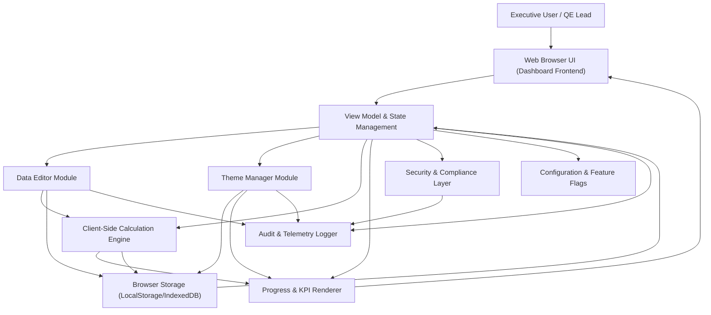

#### 1. High-Level Design

- Architecture Overview & Component Diagram:

- Component Descriptions:

  - Web Browser UI (Dashboard Frontend):  
    Single-page dashboard rendered in the browser, presenting executive KPIs, summary tiles, progress bars, and drill-down views for testing scopes, workflows, APB flows, agentification, and use-case readiness.

  - View Model & State Management:  
    Manages in-memory representation of all KPI values, counts, percentages, and theme settings. Centralizes updates from the data editor, applies calculations, and triggers UI refreshes.

  - Data Editor Module:  
    Provides editable fields for dashboard program data (testing progress, agentification, workflows, APB flows, ETAs, use-case counts). Performs client-side input validation and pushes sanitized values into the state model.

  - Theme Manager Module:  
    Handles theme selection, color customization for KPI tiles, testing scope tiles, status group backgrounds, and global themes. Ensures contrast rules are enforced before applying user-selected colors.

  - Client-Side Calculation Engine:  
    Computes completed/pending counts, progress percentages, summary KPIs, and aggregates (e.g., overall testing progress, agentification summary) from user-entered base values.

  - Progress & KPI Renderer:  
    Renders KPI tiles, progress bars, status indicators (In Progress, Design in Progress), and detailed scope-level summaries based on state and calculated metrics.

  - Browser Storage (LocalStorage/IndexedDB):  
    Persists dashboard data and theme configuration to survive browser refresh, within the constraints of the PRD (no backend DB). Segregates data (program metrics) from presentation (themes).

  - Security & Compliance Layer:  
    Cross-cutting client-side controls: input validation/sanitization, output encoding, encryption primitives (for sensitive local storage items), RBAC/ABAC enforcement when integrated with an identity provider in future, and audit hooks.

  - Audit & Telemetry Logger:  
    Captures user interactions (data edits, theme changes), validation errors, and critical events into an audit log and optional telemetry stream (e.g., browser console log or pluggable log sink).

  - Configuration & Feature Flags:  
    Enables/disable optional features such as additional theme presets, export to PDF/image, historical trend placeholders, and automated data integration (future). Keeps the MVP aligned with “Must Have / Should Have / Nice to Have” tiers.

- Integration Points & Data Flow:

  1. Data Entry & Persistence:
     - User interacts with the dashboard via the Web Browser UI.
     - Data Editor Module captures updates for:
       - Testing progress across scopes.
       - Agentification progress and ETAs.
       - Workflow and APB flow completion.
       - Use-case readiness and scope status (In Progress, Design in Progress).
     - Inputs are validated and sanitized by the Security & Compliance Layer.
     - Valid data is committed to the View Model & State Management.
     - Calculation Engine recomputes:
       - Completed vs pending counts.
       - Percentage progress per scope and overall.
       - Summary KPIs for executive tiles.
     - Updated results are persisted into Browser Storage.

  2. Theme Customization:
     - Theme Manager receives user-selected themes and colors for:
       - KPI tiles.
       - Testing scope tiles.
       - Status-group backgrounds.
       - Overall dashboard theme.
     - Theme Manager enforces contrast constraints before applying changes.
     - Theme configuration is persisted in Browser Storage.
     - KPI Renderer applies the final theme to visible components.

  3. KPI Rendering:
     - View Model exposes computed aggregates and status flags.
     - Progress & KPI Renderer:
       - Displays executive KPI tiles (testing, agentification, workflows, APB, use cases).
       - Renders counts, percentages, and progress bars.
       - Groups testing scopes by status categories.

  4. Audit & Telemetry:
     - On data or theme changes, the View Model and modules send events to the Logger.
     - Audit logs support traceability for key changes (value before/after, timestamp, and context).

- Security & Compliance Features:

  - Input Validation & Output Filtering:
    - Data editor fields enforce:
      - Numeric-only inputs for counts, percentages, and ETAs where required.
      - Range checks (e.g., 0–100 for percentages, non-negative counts).
      - Basic format validation for dates/ETAs if captured as structured fields.
    - All user-provided text (titles, labels) is HTML-escaped/encoded prior to rendering to prevent injection.

  - Encryption & Transport Security:
    - Data is primarily local per PRD (no backend DB). If optional remote sync is introduced:
      - All API calls use TLS 1.3.
      - Sensitive payload fields can be encrypted client-side using AES-256 (e.g., Crypto API) before transmission.
    - Sensitive local data (if any, like PII-labeled metrics) can be stored encrypted in IndexedDB with AES-256 and keys derived from user/session context.

  - RBAC/ABAC:
    - While PRD declares no user authentication for MVP, the design allows:
      - Role-based access control to differentiate:
        - View-only roles (executives) vs editors (QE leads).
      - Attribute-based rules (e.g., environmental context: device, tenant ID).
      - Frontend behavior:
        - Disable or hide data editor components for non-authorized roles.
        - Track role metadata in state model and audit logs.

  - Audit Logging:
    - Every significant data mutation and theme change produces an entry:
      - Event ID, timestamp.
      - Field(s) changed and new values.
      - A pseudonymous user/session ID where available.
    - Audit logs remain within the browser or can be exported as structured data (e.g., JSON file) for regulated environments.

  - Compliance Mapping:
    - Data Retention:
      - Browser-stored data is scoped to a single device/session and can be:
        - Manually cleared by the user via “Reset Data” function.
        - Automatically cleared based on retention rules (e.g., time-to-live per dataset).
    - Consent Management:
      - For environments where telemetry or external syncing is enabled:
        - A consent banner or dialogue communicates data usage.
        - Telemetry and external sync are disabled until consent is granted.
    - Data Lineage & Reporting:
      - Key metrics are derived through deterministic calculations in the Calculation Engine.
      - Each KPI can show a “source breakdown” (hover or detail view) to trace how totals are computed from per-scope values.

- Resiliency & Error Handling:

  - Retry Mechanisms:
    - Persistent storage writes (localStorage/IndexedDB) are wrapped with:
      - Limited retries for transient failures.
      - Graceful fallback to in-memory state if storage is unavailable.

  - Circuit Breakers:
    - For optional remote integrations (future):
      - External calls are guarded by a client-side circuit breaker:
        - Count failures and open circuit to stop repeated failing calls.
        - Use cached data or fallback metrics while circuit is open.

  - Fallback Patterns:
    - If theme persistence fails:
      - Revert to default theme while notifying the user.
    - If data persistence fails:
      - Keep edits in memory and prompt user to export data manually.

  - Logging & User Feedback:
    - Non-functional failures (e.g., storage quota) are logged and surfaced via unobtrusive banners.
    - Validation errors are shown inline to prevent invalid data from corrupting KPIs.

#### 2. Validation Report

- Requirements Coverage:

  - Executive KPI Summary:
    - Implemented via KPI Renderer and Calculation Engine, showing:
      - Overall testing progress.
      - Agentification progress.
      - Workflow/APB completion.
      - Use-case readiness and scope status.

  - Testing Use Case Progress & Scope Visibility:
    - State Model tracks per-scope metrics (completed vs pending, readiness).
    - Renderer groups scopes by status and exposes detailed breakdowns.

  - Agentification Progress & ETAs:
    - Data Editor allows per-scope agentification percentages and ETAs.
    - Calculation Engine aggregates to overall agentification KPIs.

  - Workflow & APB Flow Completion:
    - Dedicated metrics and tiles in Renderer.
    - Integrated with overall KPI summary.

  - In Progress / Design in Progress:
    - Status-grouped tiles for scopes.
    - Theme Manager applies distinct backgrounds for groups.

  - Editable Dashboard Data:
    - Data Editor supports editing all key metrics requested in PRD.
    - Runs validation prior to acceptance.

  - Automatic Percentage Calculation:
    - Calculation Engine computes percentages from base counts to avoid manual errors.
    - Updates progress bars immediately upon edits.

  - Theme & Color Customization:
    - Theme Manager supports:
      - Overall dashboard theme.
      - Individual KPI and scope tiles.
      - Status group backgrounds.
      - “Apply same color across all tiles” functionality.

  - Persistence Across Refresh:
    - Browser Storage retains:
      - Dashboard program data.
      - Theme settings.
    - State is restored at load and validated.

- Compliance Status:

  - Data Retention:
    - Pass (with configuration):
      - Local persistence only; data is cleared on user action or configured TTL.
      - No backend or multi-tenant cross-contamination in MVP.

  - Privacy & Consent:
    - Pass (conditional):
      - No PII or personal data is required by design; metrics are program-level.
      - If telemetry or external sync is enabled, consent prompts and toggles are included.

  - Security Controls (Client-Side):
    - Pass:
      - Input validation, output encoding, and secure storage design in place.
      - TLS 1.3 and AES-256 applicable when/if backend connectivity is added.

  - Auditability & Lineage:
    - Pass (design-level):
      - Audit Logger captures key changes.
      - KPI breakdown views document lineage from per-scope metrics.

- Identified Ambiguities/Risks:

  - Ambiguity: No Backend / Authentication (Out of Scope in PRD):
    - Risk:
      - RBAC/ABAC and shared dashboards across users are not implemented in MVP.
      - Data is device-specific and cannot be centrally governed.
    - Mitigation:
      - Design keeps a security abstraction that can be wired into an identity provider later.
      - Documentation clarifies that MVP is not suitable for multi-user regulated environments without additional layers.

  - Ambiguity: ETAs Representation:
    - Risk:
      - PRD does not specify standard date format or time zone.
      - Inconsistent representation could hamper comparison across teams.
    - Mitigation:
      - Enforce ISO-like format (e.g., YYYY-MM-DD) in the Data Editor.
      - Allow an optional “No ETA” state for scopes still being planned.

  - Risk: Manual Data Quality:
    - Risk:
      - All data is manually entered; mismatches between executive KPIs and detailed scopes are possible.
    - Mitigation:
      - Calculation Engine bases executive KPIs directly on detailed scope values.
      - Validation checks (e.g., totals vs sum of scope counts) flag discrepancies.

  - Risk: Browser Storage Limitations:
    - Risk:
      - Storage quota or browser privacy settings may clear or block persistence.
    - Mitigation:
      - Provide a data export/import feature (e.g., JSON file) as a backup.
      - Display warnings when persistence fails and instruct users on saving data externally.

  - Risk: Theme Readability:
    - Risk:
      - PRD notes inconsistent themes could harm readability and accessibility.
    - Mitigation:
      - Theme Manager enforces minimum contrast ratios.
      - Rejects or warns about configurations that fail contrast checks before applying.
