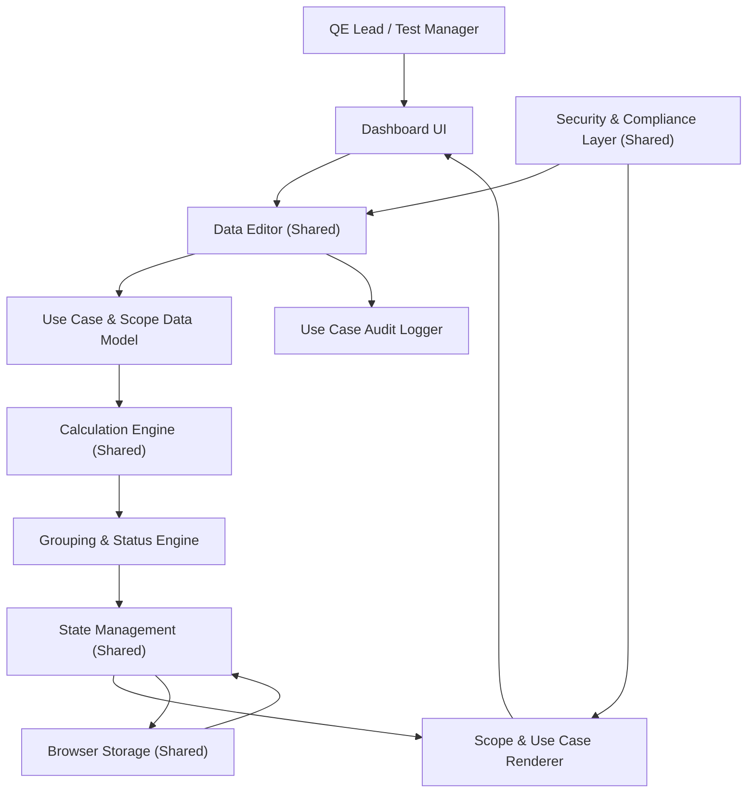

#### 1. High-Level Design

- Architecture Overview & Component Diagram:

- Component Descriptions:

  - Use Case & Scope Data Model:
    - Stores counts for completed vs pending use cases and readiness status per scope.

  - Grouping & Status Engine:
    - Organizes scopes into groups:
      - In Progress.
      - Design in Progress.
      - Other statuses as needed.

  - Scope & Use Case Renderer:
    - Visually groups scopes.
    - Shows progress percentages and agent progress per scope.

- Integration Points & Data Flow:

  - Data entry via shared Data Editor.
  - CL and GR compute percentages and groupings.
  - Renderer shows aggregated and per-scope views.

- Security & Compliance Features:

  - Shared security mechanisms for scope and use-case data.
  - Audit log for major changes to use-case counts and status.

- Resiliency & Error Handling:

  - Standard editing workflow protections:
    - Validation, storage fallback, logging.

#### 2. Validation Report

- Requirements Coverage:

  - Display of Use Case progress per scope:
    - Achieved via UC model and KP renderer.

  - Use Case Readiness:
    - Captured as attribute in UC and shown in UI.

  - Status Grouping:
    - GR groups scopes into In Progress and Design in Progress.

  - Agent Progress per Testing Scope:
    - Integrated with Agentification Data Model and renderer.

- Compliance Status:

  - Pass:
    - Satisfies PRD requirements for visualization and non-functional constraints.

- Identified Ambiguities/Risks:

  - Ambiguity: Readiness Criteria:
    - PRD does not define readiness thresholds.
    - Mitigation:
      - Document readiness categories and allow configuration (e.g., >80% ready).
