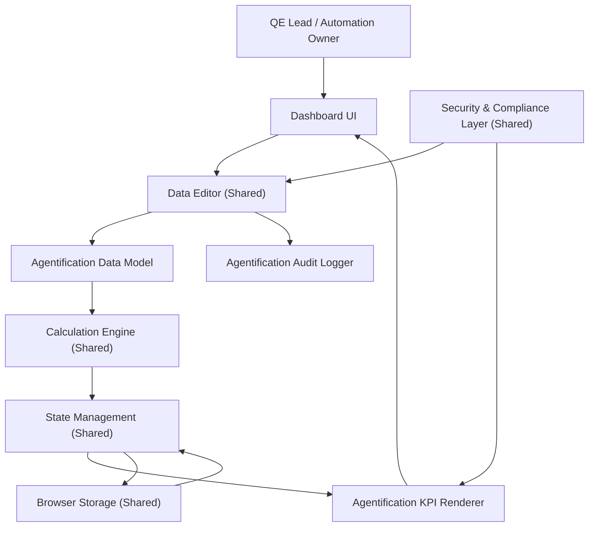

#### 1. High-Level Design

- Architecture Overview & Component Diagram:

- Component Descriptions:

  - Agentification Data Model:
    - Captures per-scope agentification status and ETAs.

  - Agentification KPI Renderer:
    - Displays:
      - Agentification progress per testing type.
      - Overall agentification status.

- Integration Points & Data Flow:

  - Manual entry through Data Editor.
  - CL computes per-scope and aggregated progress metrics.
  - KP renders summary and detail views.

- Security & Compliance Features:

  - Shared security features applied to ETAs and agentification values.
  - Audit logging for changes in ETAs and agent coverage.

- Resiliency & Error Handling:

  - Same as other editing flows:
    - Validation on ETAs and percentages.
    - Graceful handling of storage failures.

#### 2. Validation Report

- Requirements Coverage:

  - Display of Agentification progress and ETAs:
    - Implemented per testing scope with summary view.

  - Integration into scope tiles and progress bars:
    - Agentification status overlays or sub-metrics on existing tiles.

- Compliance Status:

  - Pass:
    - Meets PRD non-functional constraints.

- Identified Ambiguities/Risks:

  - Ambiguity: ETA Definition:
    - Not explicit whether ETA is per milestone or completion.
    - Mitigation:
      - Clearly define ETA semantics in UI labels (e.g., “Expected Automation Completion Date”).
