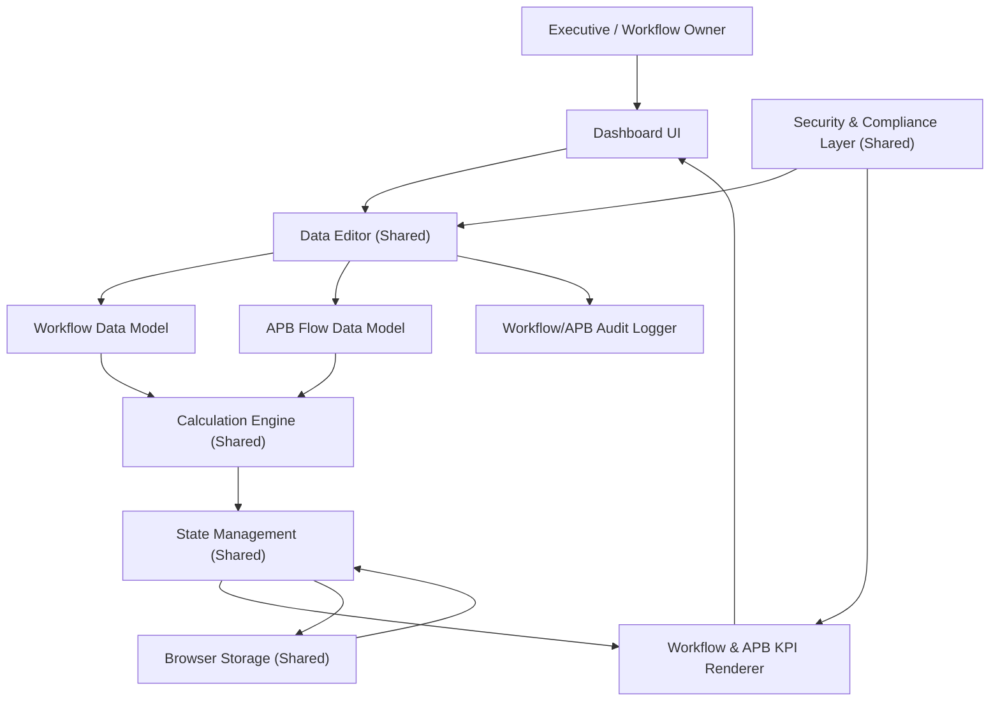

#### 1. High-Level Design

- Architecture Overview & Component Diagram:

- Component Descriptions:

  - Workflow Data Model & APB Flow Data Model:
    - Structures storing status (completed, in progress, pending) and counts.

  - Workflow & APB KPI Renderer:
    - Visual overview:
      - Summary tiles for completion.
      - Progress bars.

- Integration Points & Data Flow:

  - Data entry through shared editor.
  - Calculation engine computes completion percentages and integrates into executive KPIs.
  - Browser Storage retains states.

- Security & Compliance Features:

  - Reuse from shared Security Layer.
  - Log workflow/APB changes for traceability.

- Resiliency & Error Handling:

  - Same patterns as QE-3957 for data editing and persistence.

#### 2. Validation Report

- Requirements Coverage:

  - Visualization of Workflow & APB Progress:
    - Completed vs in progress vs pending.
    - Integrated into executive summary.

  - Integration with overall program KPIs:
    - CL adds these metrics into QE-3953’s summary.

- Compliance Status:

  - Pass:
    - Aligns with PRD’s non-functional requirements.

- Identified Ambiguities/Risks:

  - Ambiguity: Granularity of Workflows:
    - Not specified whether per workflow or aggregate only.
    - Mitigation:
      - Support both summary and optional list detail while clarifying scope in documentation.
