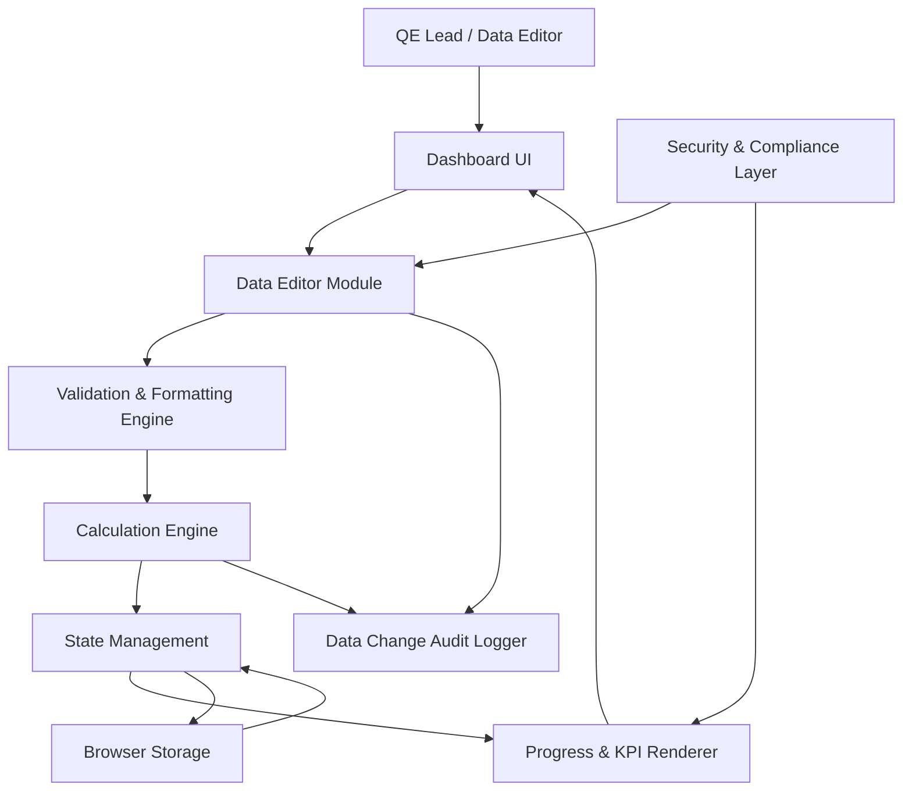

#### 1. High-Level Design

- Architecture Overview & Component Diagram:

- Component Descriptions:

  - Data Editor Module:
    - UI for editing:
      - Testing data fields.
      - KPI values.
      - Testing statuses.
      - ETAs and counts.

  - Validation & Formatting Engine:
    - Enforces numeric formats, ranges, and required fields.
    - Normalizes data units (e.g., percent vs integer counts).

  - Calculation Engine:
    - Computes percentages and progress metrics based on base values.
    - Ensures consistency across scopes and overall KPIs.

  - State Management:
    - Central store of all metrics and statuses.

  - Progress & KPI Renderer:
    - Visual representation of updated metrics (bars, tiles, counts).

  - Browser Storage:
    - Persists edited data; ensures survival across refresh.

  - Security & Compliance Layer:
    - Protects from injection or data corruption.

  - Data Change Audit Logger:
    - Tracks edits for traceability and compliance.

- Integration Points & Data Flow:

  1. Edit Flow:
     - User modifies values via Data Editor.
     - VF validates inputs:
       - Rejects or adjusts invalid values.
     - CL recomputes percentages and KPI metrics.
     - VM updates state and pushes changes to Renderer.

  2. Persistence:
     - On successful update, VM commits new data to ST.
     - On reload, ST seeds VM with previous values.

- Security & Compliance Features:

  - Input Validation:
    - Strict numeric fields for counts and percentages.
    - Controlled selection lists for statuses (e.g., In Progress, Design in Progress).

  - Output Filtering:
    - No direct injection from user text into HTML; all text encoded.

  - Encryption & TLS:
    - For any optional remote synchronization:
      - Use AES-256 for stored sensitive data and TLS 1.3 for transport.

  - RBAC/ABAC:
    - Editing restricted to authorized roles.
    - View-only roles cannot access Data Editor controls.

  - Audit Logging:
    - Every edit yields an audit log entry with timestamp and context.

- Resiliency & Error Handling:

  - Validation Failures:
    - Prevent commit and show inline messages.
  
  - Storage Errors:
    - If persistence fails, editing is limited to current session; user is alerted.

  - Calculation Errors:
    - Any calculation anomaly logs error and uses fallback values.

#### 2. Validation Report

- Requirements Coverage:

  - Editable Data Fields:
    - Fully addressed via Data Editor.

  - Automatic Percentage Calculations:
    - Implemented in Calculation Engine.

  - Inline Editing Experience:
    - UI supports inline edits with immediate recalculation and re-render.

  - Persistence after Refresh:
    - Browser Storage manages data retention.

- Compliance Status:

  - Data Integrity:
    - Pass:
      - Validation and calculation pipeline ensures correct percentages.

  - Security:
    - Pass:
      - Input validation, output encoding, and audit logs.

- Identified Ambiguities/Risks:

  - Ambiguity: Source of Truth:
    - PRD states no backend; yet in enterprise environment, duplication of KPIs may arise.
    - Mitigation:
      - Document that dashboard is “presentation” layer and not official system of record.

  - Risk: Multi-user Edits:
    - No concurrent editing support.
    - Mitigation:
      - Single-owner editing guidance.
      - Possible future integration with central data source.
