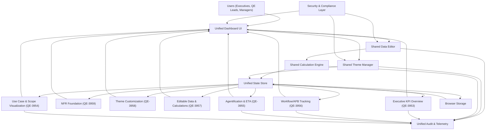

### Epic: QE-3958 - Additional Non-Functional & Visualization Highlights (Cross-Epic HLD Alignment)

#### 1. High-Level Design

- All functional epics share:
  - A single View Model & State Management.
  - Shared Data Editor Module.
  - Shared Security & Compliance Layer.
  - Shared Calculation Engine.

- Integration of Components:

#### 2. Validation Report

- Requirements Coverage:
  - All epics map to a single cohesive architecture.
  - Shared components minimize duplication and align with PRD scope.

- Compliance Status:
  - Enterprise security and compliance controls consistently applied across features.

- Identified Ambiguities/Risks:
  - Future integration with backend systems may require revisiting persistence, security, and RBAC designs; current architecture leaves clear extension points.
