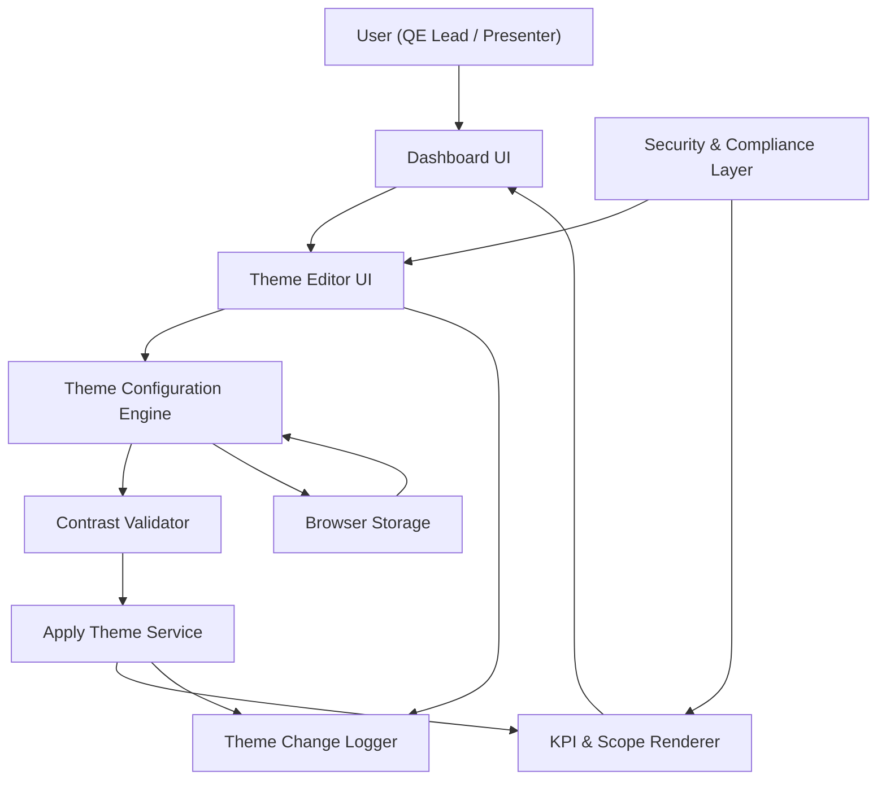

#### 1. High-Level Design

- Architecture Overview & Component Diagram:

- Component Descriptions:

  - Theme Editor UI:
    - Visual settings panel for:
      - Global dashboard themes.
      - Individual KPI tile colors.
      - Individual testing scope tile colors.
      - Status color palette and group background colors.
      - “Apply same color across all KPI tiles/testing scope tiles.”

  - Theme Configuration Engine:
    - Normalizes theme data (e.g., maps user choices to canonical color tokens).
    - Manages theme presets and saves user-defined themes.

  - Contrast Validator:
    - Evaluates contrast between foreground (text, indicators) and background.
    - Enforces minimum contrast thresholds.

  - Apply Theme Service:
    - Applies validated theme changes to PR (KPI & Scope Renderer).
    - Ensures atomic application (all-or-nothing) to avoid partial or inconsistent UI.

  - KPI & Scope Renderer:
    - Uses theme tokens to style tiles and groups.

  - Browser Storage:
    - Stores current and saved themes and the default theme settings.

  - Security & Compliance Layer:
    - Prevents malicious injection via CSS-like inputs, ensures safe handling of color parameters.

  - Theme Change Logger:
    - Records theme changes and presets usage for audit and troubleshooting.

- Integration Points & Data Flow:

  1. Theme Selection & Editing:
     - User opens Theme Editor UI.
     - Theme Configuration Engine:
       - Loads current and preset themes from Browser Storage.
     - On change:
       - Inputs are validated (e.g., hex color format).
       - CV checks contrast.
       - On success, AP updates Renderer.
     - If user selects “Apply same color across all tiles,” TC propagates to all relevant tokens.

  2. Theme Persistence:
     - Themes are saved via ST (Browser Storage).
     - On dashboard load:
       - TC loads default or last-used theme and re-applies.

  3. Export Features (Nice to have, optional):
     - For PDF/image export:
       - AP ensures theme is stable prior to rendering export.
       - Export function uses current theme for consistent presentation.

- Security & Compliance Features:

  - Input Validation:
    - Prevents injection through computed styles:
      - Colors must match safe formats (e.g., #RRGGBB or whitelist).
      - No custom CSS rules accepted.

  - Output Filtering:
    - Theme tokens are applied through safe style bindings (framework binding or sanitized inline styles), avoiding direct string injection.

  - Encryption & TLS:
    - If themes sync to a remote service:
      - AES-256 encryption for any stored theme data.
      - TLS 1.3 for data in transit.

  - RBAC/ABAC:
    - Theme editing may be restricted to:
      - “Editor” roles; view-only roles cannot change themes.
      - ABAC rules may restrict theme editing to specific environments (e.g., test vs production).

  - Audit Logging:
    - Theme changes recorded with before/after snapshots and timestamp for traceability.

- Resiliency & Error Handling:

  - Validation Failures:
    - If contrast fails, user is informed and theme changes are blocked or adjusted automatically.
  
  - Storage Failures:
    - If theme persistence fails:
      - Theme remains applied in memory only.
      - User is notified that theme may reset after refresh.

  - Fallback Themes:
    - Hard-coded default theme ensures readability if theme loading fails.

#### 2. Validation Report

- Requirements Coverage:

  - Theme Editor UI:
    - Fully addressed via Theme Editor and Configuration Engine.

  - Individual Tile Colors & Group Backgrounds:
    - Supported through configurable tokens per KPI tile, testing scope tile, and status group backgrounds.

  - Editable Status Colors:
    - Part of theme configuration for status indicators.

  - Apply Same Color Across Tiles:
    - Implemented through bulk application function.

  - Save & Reset Theme:
    - Save to Browser Storage; Reset applies default.

  - Additional Presets & Export:
    - Designed as optional features managed by feature flags.

- Compliance Status:

  - Visual Accessibility:
    - Pass:
      - Contrast Validator ensures minimum contrast between text and background.

  - Security:
    - Pass:
      - No direct dynamic CSS injection.
      - Safe color validation and binding.

- Identified Ambiguities/Risks:

  - Ambiguity: Contrast Threshold:
    - PRD mandates “sufficient contrast” but not numeric ratio.
    - Mitigation:
      - Align with WCAG AA-level ratio (e.g., 4.5:1 for body text).

  - Risk: User Over-Customization:
    - Excessive theme variation could confuse cross-team audiences.
    - Mitigation:
      - Provide “approved presets” aligned with corporate branding.
      - Optionally limit per-tenant customization in regulated environments.
