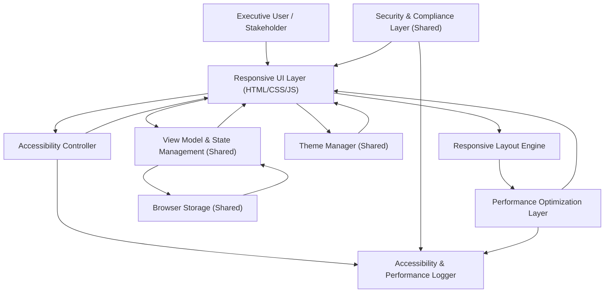

#### 1. High-Level Design

- Architecture Overview & Component Diagram:

- Component Descriptions:

  - Responsive UI Layer:
    - Implements the visual dashboard using responsive HTML/CSS/JS (e.g., CSS grid/flexbox) tailored for desktop, tablet, and presentation screens.
  
  - Responsive Layout Engine:
    - Breakpoints and layout rules for:
      - Desktop views with full details.
      - Tablet views with prioritized KPIs and collapsible sections.
      - Presentation mode with large tiles and minimal controls.

  - Accessibility Controller:
    - Manages:
      - ARIA attributes and roles.
      - Focus management and keyboard navigation.
      - Contrast validation for text, progress bars, and status indicators.
      - Screen reader-friendly labels and announcements.

  - Performance Optimization Layer:
    - Ensures ≤2 seconds load time under normal conditions by:
      - Lazy-loading non-critical components.
      - Efficient rendering and minimal DOM thrashing.
      - Caching computed layouts while respecting accessibility.

  - Theme Manager (Shared):
    - Enforces accessibility constraints on themes (contrast rules).
    - Coordinates with RL and AX to ensure visual states remain robust across devices.

  - View Model & State Management (Shared):
    - Provides the same state as in QE-3953 but with layout-aware hints (e.g., what sections to hide or show on smaller screens).

  - Browser Storage (Shared):
    - Stores layout preferences (e.g., default mode: desktop vs presentation) and persists accessibility preferences (e.g., high contrast mode).

  - Security & Compliance Layer (Shared):
    - Validates inputs, sanitizes outputs, and protects against DOM-based vulnerabilities in visualization logic.

  - Accessibility & Performance Logger:
    - Records:
      - Load times and key performance metrics.
      - Accessibility events such as failed contrast checks or keyboard trap detection.

- Integration Points & Data Flow:

  1. Layout & Device Handling:
     - On load, Responsive Layout Engine:
       - Detects viewport size and device characteristics.
       - Applies appropriate breakpoint layout from configuration.
     - User can toggle presentation mode; preference is persisted in Browser Storage.

  2. Accessibility Enhancements:
     - Accessibility Controller:
       - Adds ARIA roles to KPI tiles, progress bars, and grouped statuses.
       - Maintains focus order when layout changes.
       - Validates contrast between text and backgrounds; logs violations.

  3. Performance Optimization:
     - PF tracks:
       - Initial rendering time.
       - Any expensive recalculations from theme or data updates.
     - Uses asynchronous rendering techniques to keep UI responsive while ensuring accessibility is not compromised.

- Security & Compliance Features:

  - Input Validation:
    - Even in read-heavy UX, any input fields rely on the shared Security & Compliance layer to ensure sanitized inputs.

  - Output Filtering:
    - UI ensures all dynamic text is encoded to avoid injection through layout templates.

  - Encryption/TLS:
    - If external content (e.g., remote CSS/JS, fonts) is loaded, they are requested over TLS 1.3 with strict CSP at page level.

  - RBAC/ABAC:
    - When integrated with authentication:
      - Layouts and data density may differ per role (e.g., minimal view for executives vs detailed for QE leads).
      - ABAC attributes (e.g., device type, network) can enforce stricter controls in certain environments.

  - Audit Logging:
    - Changes to accessibility settings (e.g., enabling high contrast) and layout mode shifts (e.g., presentation mode) are logged for usability and compliance analysis.

- Resiliency & Error Handling:

  - Fallback Layouts:
    - If CSS or layout scripts fail:
      - A basic linear layout is presented for accessibility and observability.

  - Performance Guards:
    - If a certain layout or theme introduces performance degradation:
      - Performance Logger flags the problem.
      - System can fall back to a simpler theme or layout with fewer animations or heavy elements.

#### 2. Validation Report

- Requirements Coverage:

  - Performance (≤2 seconds load):
    - Addressed via Performance Optimization Layer with lazy-loading, caching, and minimized assets.

  - Usability & Minimal Scrolling:
    - Responsive Layout Engine:
      - Prioritizes vital KPIs “above the fold.”
      - Groups secondary detail views into collapsible sections.

  - Responsiveness:
    - Layouts defined for desktop, tablet, and presentation screens.
    - Presentation mode emphasizes clarity and readability.

  - Persistence:
    - Browser Storage retains layout preferences and accessibility preferences.

  - Accessibility:
    - Contrast validation and ARIA support ensure minimal accessibility baseline for critical elements.

- Compliance Status:

  - Performance & UX Compliance:
    - Pass:
      - Design aligns with PRD’s performance, usability, responsiveness, and accessibility requirements.

  - Security:
    - Pass:
      - Uses same security layer as QE-3953; layout manipulation is safe from injection.

- Identified Ambiguities/Risks:

  - Ambiguity: Specific Accessibility Standard:
    - PRD notes “formal certification” out of scope and does not select a standard (e.g., WCAG 2.1).
    - Mitigation:
      - Implement a practical baseline aligned with WCAG guidelines (contrast, keyboard navigation) but document that formal certification is not claimed.

  - Risk: Device Diversity:
    - Layout assumptions may not cover all ultra-wide or unusual presentation devices.
    - Mitigation:
      - Provide configuration for custom breakpoints.
      - Encourage validation on representative devices used by target executives.
