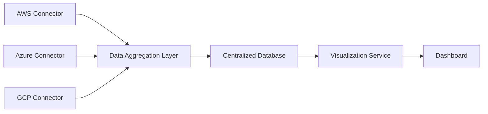

#### 1. High-Level Design
- Summary: This epic covers the foundational capability to automatically collect, aggregate, and display AI technology usage and spending data from AWS, Azure, and GCP.
- Component Flow: 

- Integration Points: Integration with AWS, Azure, and GCP AI services.

#### 2. Validation Report
- Requirements Coverage: The design covers the primary requirement of aggregating data from the three specified major cloud providers and visualizing it.
- Identified Gaps/Risks: The epic's success is highly dependent on external factors, including the "willingness" of portfolio companies to enable data integrations and the stability of cloud provider APIs. These dependencies pose a significant risk.