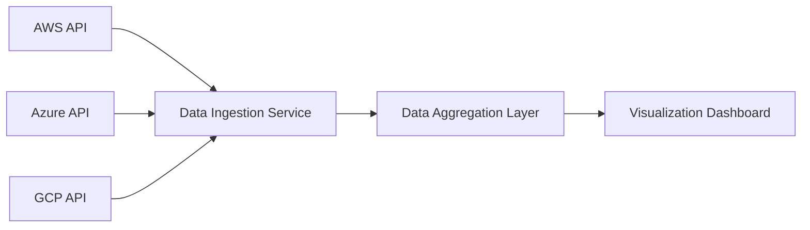

#### 1. High-Level Design
- Summary: This epic's core requirement is to automatically collect, aggregate, and display AI technology usage and spending data from major cloud providers (AWS, Azure, GCP) in a single, consolidated real-time dashboard.
- Component Flow: 

- Integration Points: Upstream systems are the APIs for AWS, Azure, and GCP AI services. The downstream system is the visualization dashboard itself.
- Key Assumptions: Assumes portfolio companies will provide the necessary API credentials with read-only access. Assumes data is aggregated on a daily schedule.
- NFR Highlights: System shall support up to 200 portfolio companies and 1,000 concurrent users.
#### 2. Validation Report
- Requirements Coverage: The design covers the core scope of integrating with the three specified cloud providers and consolidating their data.
- Identified Gaps/Risks: The primary risk is the dependency on portfolio companies' willingness and ability to provide secure API access. A lack of cooperation would render the system useless for those companies.
