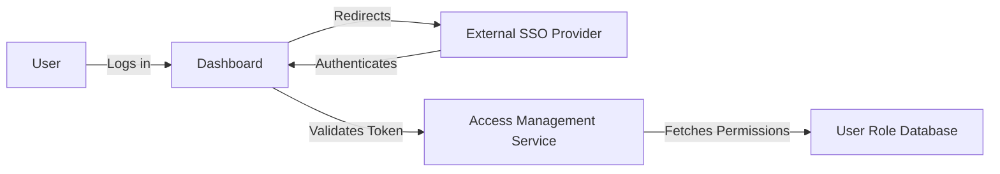

#### 1. High-Level Design
- Summary: This epic focuses on establishing a secure access framework using role-based access control (RBAC) and integrating with existing enterprise single sign-on (SSO) systems.
- Component Flow: 

- Integration Points: Relies on integration with clients' existing SSO solutions for user authentication.

#### 2. Validation Report
- Requirements Coverage: The design addresses the core requirements of RBAC, user permission management, and SSO integration.
- Identified Gaps/Risks: The epic assumes all clients have a compatible SSO solution; a fallback authentication method may be needed. The specific SSO standards (e.g., SAML, OAuth 2.0) are not specified, which could lead to integration challenges.