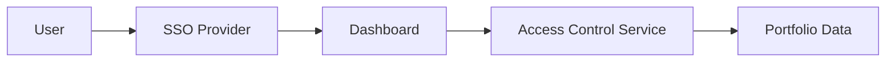

#### 1. High-Level Design
- Summary: To establish a secure access framework using role-based access control (RBAC) to protect sensitive portfolio company data and integrating with existing enterprise single sign-on (SSO) solutions for authentication.
- Component Flow: 

- Integration Points: Integration with clients' existing SSO solutions for user authentication.
- Key Assumptions: Assumes SSO integration will use a standard protocol like SAML 2.0 or OIDC. Assumes a predefined, limited set of roles (e.g., Partner Admin, Portfolio Viewer) will be sufficient.
- NFR Highlights: All data in transit and at rest shall be encrypted using industry-standard protocols (e.g., TLS 1.2+, AES-256).
#### 2. Validation Report
- Requirements Coverage: The design directly addresses the requirements for RBAC and SSO integration.
- Identified Gaps/Risks: The epic mentions "audit logging" as mandatory but does not specify what events must be logged. This ambiguity could lead to compliance gaps if not clarified.
