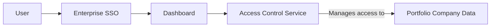

#### 1. High-Level Design
- Summary: This epic focuses on establishing a secure access framework using role-based access control (RBAC), managing user permissions for portfolio company data, and integrating with existing enterprise Single Sign-On (SSO) solutions.
- Component Flow: 

- Integration Points: This epic relies on integration with clients' existing SSO solutions for user authentication.

#### 2. Validation Report
- Requirements Coverage: The design adequately covers the requirements for RBAC, permission management, and SSO integration.
- Identified Gaps/Risks: A potential risk is the complexity of integrating with a variety of different SSO solutions across multiple clients. The process for mapping roles and attributes from different SSO providers to the platform's internal RBAC system needs to be clearly defined.
