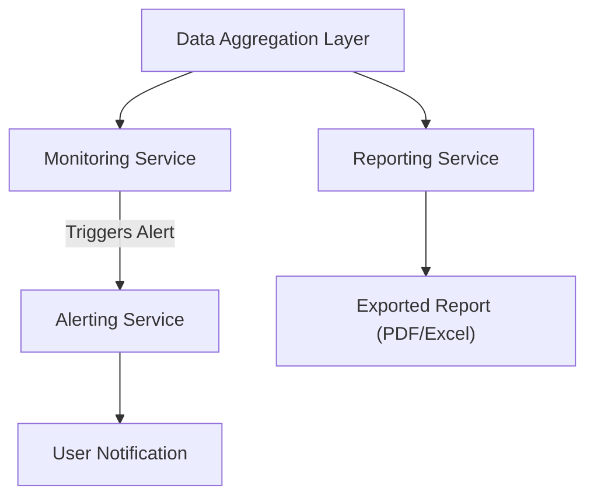

#### 1. High-Level Design
- Summary: This epic enables proactive portfolio management by providing automated alerts for budget overruns and data staleness, as well as the ability to export dashboard views for offline analysis.
- Component Flow: 

- Integration Points: Depends on the data aggregation epic to have up-to-date spend and usage data.

#### 2. Validation Report
- Requirements Coverage: The design covers the requirements for automated alerts on budget thresholds and data freshness, as well as report exporting.
- Identified Gaps/Risks: The specific channels for user notifications (e.g., email, SMS, in-app) are not defined. The process for generating "Monthly executive summaries" is ambiguous.