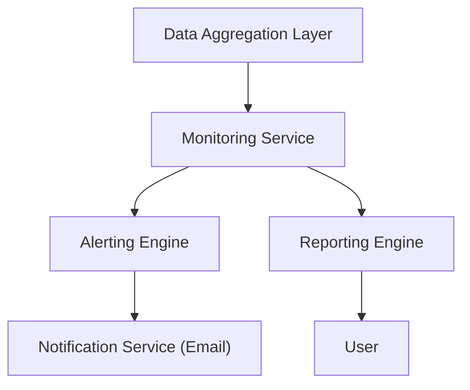

#### 1. High-Level Design
- Summary: To enable proactive portfolio management by providing automated alerts for budget overruns and data staleness, and allowing dashboard views to be exported as PDF/Excel for stakeholder communication.
- Component Flow: 

- Integration Points: Depends on the data aggregation epic (like QE-3969) to have up-to-date spend and usage data to monitor.
- Key Assumptions: Assumes alerts are sent via email to designated contacts. Assumes the exported reports are based on predefined templates of existing dashboard views.
- NFR Highlights: Alerts sent to Operating Partners within 5 minutes of detection.
#### 2. Validation Report
- Requirements Coverage: The design covers the requirements for alerting, reporting, and notifications as specified.
- Identified Gaps/Risks: The effectiveness of the alerting system is highly dependent on the timeliness and reliability of the upstream data aggregation epic. Any delays there will directly impact this epic's NFRs.
