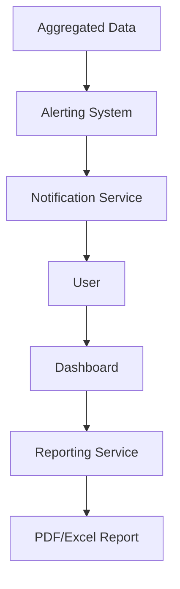

#### 1. High-Level Design
- Summary: This epic aims to enable proactive portfolio management by providing automated alerts for budget overruns and data staleness, and allowing users to export dashboard views as PDF/Excel reports for stakeholder communication.
- Component Flow: 

- Integration Points: Depends on the data aggregation epic to have up-to-date spend and usage data for triggering alerts and generating reports.

#### 2. Validation Report
- Requirements Coverage: The design covers the specified scope for automated alerts and report exporting.
- Identified Gaps/Risks: The mechanism for configuring budget thresholds for alerts is not defined. The NFR for sending alerts within 5 minutes of detection implies a near real-time processing pipeline, which could be a technical challenge depending on the data volume.
