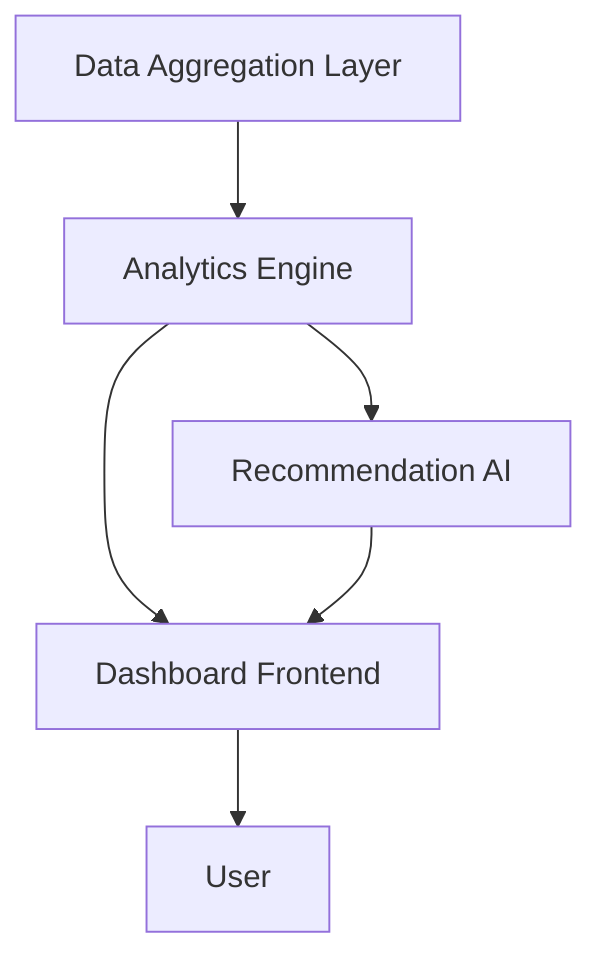

#### 1. High-Level Design
- Summary: This epic's core requirement is to provide advanced analytical capabilities, including performance comparisons between companies, detailed drill-downs into usage data, and intelligent recommendations to optimize AI return on investment.
- Component Flow: 

- Integration Points: Relies on the core data aggregation epic (like QE-3969) for the underlying dataset.
- Key Assumptions: Assumes the AI-driven recommendations will focus on cost optimization based on usage patterns. Assumes the data format for scenario simulations will be user-input parameters via the dashboard.
- NFR Highlights: Dashboard pages shall load within 3 seconds, even when drilling down into detailed analytics.
#### 2. Validation Report
- Requirements Coverage: The high-level design covers the epic's scope by including an analytics engine, a recommendation AI, and the dashboard for visualization and interaction.
- Identified Gaps/Risks: The epic lacks specificity on the algorithms for the "intelligent recommendations," which could be a potential scope creep risk if not clearly defined.
