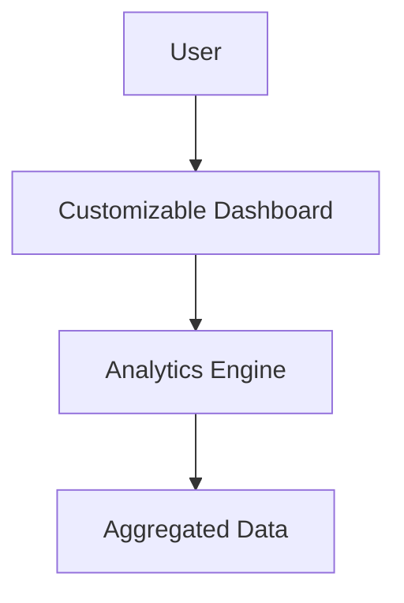

#### 1. High-Level Design
- Summary: This epic's core requirement is to provide advanced analytical capabilities, enabling users to compare performance across companies, drill down into usage details, and receive AI-driven recommendations for optimization. The scope includes benchmarking tools, drill-down analytics, customizable dashboards, and cost-saving simulations.
- Component Flow: 

- Integration Points: This epic relies on the core data aggregation epic for the underlying dataset.

#### 2. Validation Report
- Requirements Coverage: The proposed design covers the core requirements, including benchmarking, drill-down analytics, and recommendations by using an analytics engine on top of the aggregated data.
- Identified Gaps/Risks: The epic mentions "AI-driven recommendations," which is ambiguous. The specific logic and data models required for these recommendations are not defined. The performance NFR of dashboards loading within 3 seconds during drill-downs presents a technical risk that requires careful back-end and front-end optimization.
