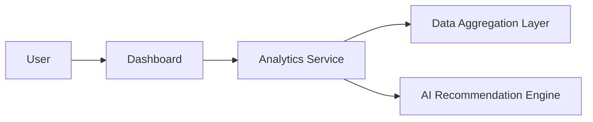

#### 1. High-Level Design
- Summary: This epic provides deeper analytical capabilities, allowing users to compare performance across companies, drill down into specific usage details, and receive intelligent recommendations for optimization.
- Component Flow: 

- Integration Points: Relies on the core data aggregation epic for the underlying dataset.

#### 2. Validation Report
- Requirements Coverage: The design covers the epic's stated scope, including benchmarking, drill-down analytics, and AI-driven recommendations.
- Identified Gaps/Risks: The mechanism and complexity of the "AI-driven recommendations for cost optimization" are not detailed, which could be a potential risk in implementation.