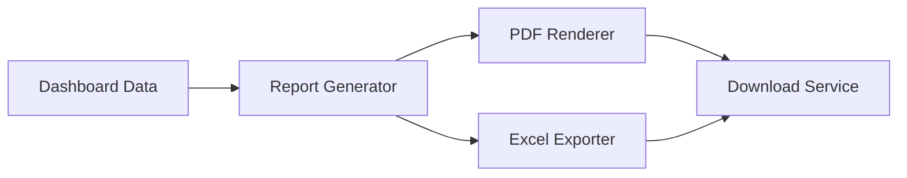

#### 1. High-Level Design

- **Summary**: This epic enables comprehensive reporting capabilities allowing users to generate and export professional reports in PDF and Excel formats. Reports can be created on-demand for board meetings, investor updates, and due diligence, including executive summaries, AI adoption comparisons, cost savings analysis, and pre/post-investment metrics. Reports must be generated within 10 seconds and support up to 50 portfolio companies.

- **Component Flow**:

- **Integration Points**: 
  - Dashboard Visualization epic (upstream source of data to be reported)
  - PDF generation library (e.g., wkhtmltopdf, Puppeteer, or cloud service)
  - Excel export library (e.g., Apache POI, ExcelJS)
  - File storage service for temporary report storage

- **Key Assumptions**: 
  - Standard report templates will meet most stakeholder needs; custom templates are out of scope
  - Reports will be generated synchronously; users will wait for download to complete

- **NFR Highlights**: Reports must be generated and downloaded within 10 seconds; export functionality must support datasets with up to 50 portfolio companies; generated reports must maintain data accuracy and formatting consistency.

#### 2. Validation Report

- **Requirements Coverage**: The design covers all specified report types (executive summary, AI adoption comparison, cost savings, pre/post-investment metrics) and export formats (PDF, Excel) within the 10-second performance requirement.

- **Identified Gaps/Risks**: 
  - Report template designs and branding guidelines not specified
  - Handling of large datasets (approaching 50 companies) may require optimization to meet 10-second target
  - Report versioning and audit trail not mentioned in epic scope