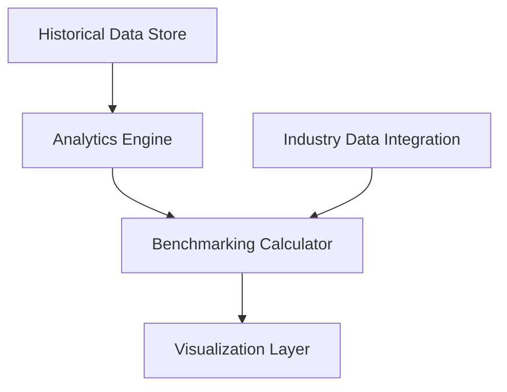

#### 1. High-Level Design

- **Summary**: This epic provides advanced analytical capabilities enabling cross-portfolio benchmarking of AI adoption and spend. Users can compare portfolio companies against each other and industry averages, analyze trends over 24 months of historical data, identify outliers, and discover best practices. Benchmarking calculations complete within 5 seconds for up to 200 companies.

- **Component Flow**:

- **Integration Points**: 
  - Data Integration and Aggregation epic (for historical and current portfolio data)
  - External industry benchmark data sources (third-party market intelligence providers)
  - Dashboard Visualization epic (downstream consumer of analytics)

- **Key Assumptions**: 
  - Industry benchmark data is available through third-party providers or can be sourced from public market research
  - 24 months of historical data is sufficient for meaningful trend analysis

- **NFR Highlights**: Benchmarking calculations must complete within 5 seconds; system must support comparison across up to 200 portfolio companies; analytics must handle historical data for at least 24 months.

#### 2. Validation Report

- **Requirements Coverage**: The design addresses cross-company benchmarking, industry comparisons, trend analysis, outlier identification, and performance ranking within the specified performance constraints.

- **Identified Gaps/Risks**: 
  - Availability and cost of external industry benchmark data not confirmed
  - Statistical methodology for outlier detection not specified
  - Handling of companies with incomplete historical data not addressed