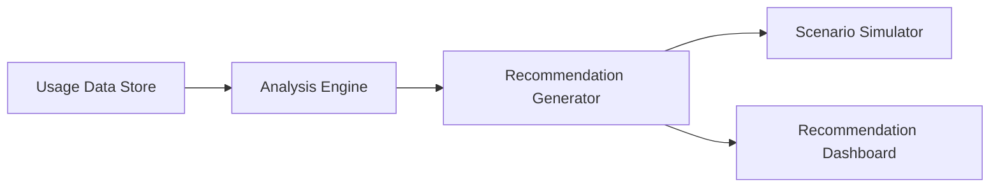

#### 1. High-Level Design

- **Summary**: This epic delivers an AI-driven recommendation engine that analyzes usage patterns across portfolio companies to identify cost-saving opportunities such as vendor consolidation, redundancy elimination, and resource rightsizing. The system generates at least one actionable recommendation per company per quarter and includes scenario simulation capabilities.

- **Component Flow**:

- **Integration Points**: 
  - Data Integration and Aggregation epic (upstream dependency for usage data)
  - Benchmarking and Analytics epic (for comparative context)
  - External pricing data sources for AI services (vendor APIs or market data feeds)

- **Key Assumptions**: 
  - Industry best practices and pricing data for AI services are available from external sources or can be manually curated
  - Recommendation quality will improve over time as historical data accumulates

- **NFR Highlights**: Must generate at least one actionable recommendation per company per quarter; recommendation engine must process data for up to 200 companies based on verifiable usage patterns and industry best practices.

#### 2. Validation Report

- **Requirements Coverage**: The design covers usage pattern analysis, redundancy identification, vendor consolidation suggestions, and scenario simulation as specified. The quarterly recommendation target is achievable with batch processing.

- **Identified Gaps/Risks**: 
  - Definition of "actionable recommendation" quality criteria not specified
  - External pricing data source availability and update frequency not confirmed
  - Recommendation acceptance tracking mechanism not detailed in epic