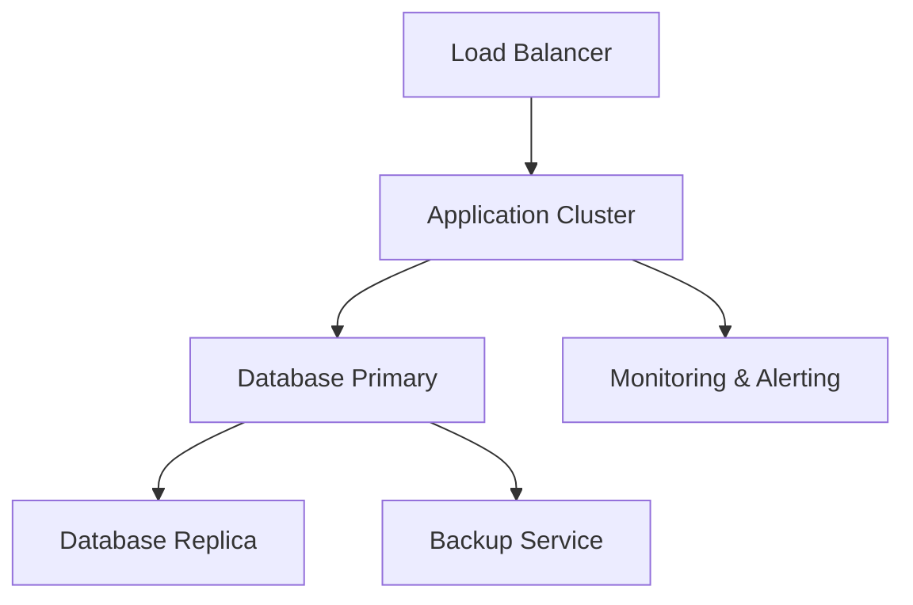

#### 1. High-Level Design

- **Summary**: This epic establishes the foundational cloud infrastructure to deliver a highly available, scalable, and secure AI Portfolio Management Dashboard platform. It covers cloud provisioning, automated failover, daily backups, performance monitoring, security hardening, and disaster recovery to achieve 99.5% uptime while supporting up to 1,000 concurrent users and 200 portfolio companies.

- **Component Flow**:

- **Integration Points**: 
  - Cloud provider infrastructure (AWS, Azure, or GCP)
  - Monitoring and observability tools (e.g., CloudWatch, Azure Monitor, Stackdriver)
  - Backup and disaster recovery services
  - TLS certificate management services

- **Key Assumptions**: 
  - Single-region deployment is sufficient for initial release; multi-region can be added later
  - Cloud provider's native services will be used for backup, monitoring, and failover capabilities

- **NFR Highlights**: System must achieve 99.5% uptime, support 1,000 concurrent users and 200 portfolio companies, load pages within 3 seconds for 95% of interactions, encrypt data in transit (TLS 1.2+) and at rest (AES-256), and perform daily automated backups.

#### 2. Validation Report

- **Requirements Coverage**: The design addresses all stated requirements including uptime targets, scalability limits, performance benchmarks, security encryption standards, and backup frequency. The architecture supports horizontal scaling and automated failover.

- **Identified Gaps/Risks**: 
  - Specific cloud provider not yet selected; choice will impact implementation details
  - Disaster recovery RTO/RPO targets not explicitly defined in epic
  - Performance testing strategy for 1,000 concurrent users needs detailed planning