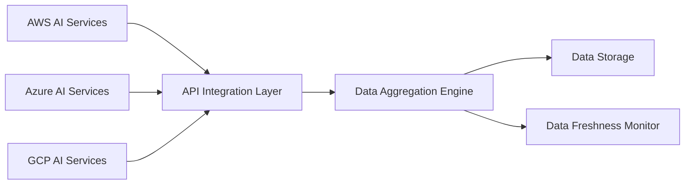

#### 1. High-Level Design

- **Summary**: This epic enables automated integration with AWS, Azure, and GCP AI services to aggregate usage and spend data from up to 200 portfolio companies. The system collects data via secure APIs, monitors data freshness, and provides real-time visibility into AI technology adoption across the portfolio, forming the foundation for all analytics and reporting.

- **Component Flow**:

- **Integration Points**: 
  - Upstream: AWS cloud provider APIs (AI services usage and billing data)
  - Upstream: Azure cloud provider APIs (AI services usage and billing data)
  - Upstream: GCP cloud provider APIs (AI services usage and billing data)
  - Upstream: Portfolio companies' cloud environments requiring API access permissions
  - Downstream: Dashboard Visualization epic for data presentation
  - Downstream: Alerting and Notifications epic for data quality alerts

- **Key Assumptions**: 
  - Cloud provider APIs will return usage and cost data in standardized JSON format with consistent schemas
  - Portfolio companies will grant read-only API access to their cloud billing and AI service usage data

- **NFR Highlights**: Data updated within 24 hours for 95% of companies; support up to 200 portfolio companies; 99.5% uptime with automated failover; all data encrypted in transit (TLS 1.2+) and at rest (AES-256); dashboard pages load within 3 seconds

#### 2. Validation Report

- **Requirements Coverage**: The design covers all stated requirements including multi-cloud integration, automated data ingestion, real-time aggregation, data freshness monitoring, and security encryption. All NFRs regarding data freshness, scale, uptime, and security are addressed.

- **Identified Gaps/Risks**: 
  - Epic does not specify API rate limiting strategy or retry logic for failed API calls
  - Data schema mapping and normalization approach across different cloud providers not detailed
  - Handling of API versioning changes and backward compatibility not specified
  - No detail on incremental vs. full data refresh strategy or historical data retention policy
  - Mechanism for onboarding new portfolio companies and obtaining API credentials not defined