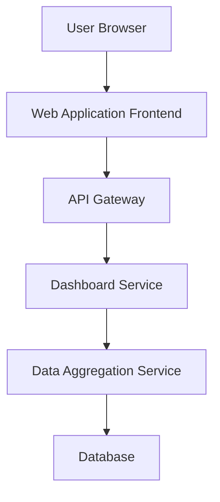

#### 1. High-Level Design

- **Summary**: This epic delivers a cloud-based dashboard interface that visualizes AI usage and spend data across portfolio companies. It provides consolidated views, customizable widgets, personalized user views, and intuitive navigation for stakeholders to monitor AI adoption and performance metrics in real-time.

- **Component Flow**:

- **Integration Points**: 
  - Upstream: Data Integration and Aggregation epic for underlying usage and spend data
  - Upstream: SSO provider for user authentication
  - Downstream: Role-Based Access Control epic for permission enforcement

- **Key Assumptions**: 
  - Dashboard widgets will use standard chart types (bar, line, pie) with predefined configurations
  - User preferences and saved views will be stored per user account with default templates provided

- **NFR Highlights**: Dashboard pages must load within 3 seconds for 95% of interactions; support 1,000 concurrent users; meet WCAG 2.1 AA accessibility standards including keyboard navigation and screen reader compatibility

#### 2. Validation Report

- **Requirements Coverage**: The design covers the epic's stated scope including consolidated views, customizable widgets, personalized views, drill-down capabilities, and accessibility requirements. All NFRs regarding performance, concurrency, and accessibility are addressed.

- **Identified Gaps/Risks**: 
  - Epic does not specify the exact set of default widgets or customization options available to users
  - No detail on how data freshness indicators will be visually represented
  - Widget refresh frequency and real-time update mechanism not specified
  - Offline/degraded mode behavior when backend services are unavailable is not addressed