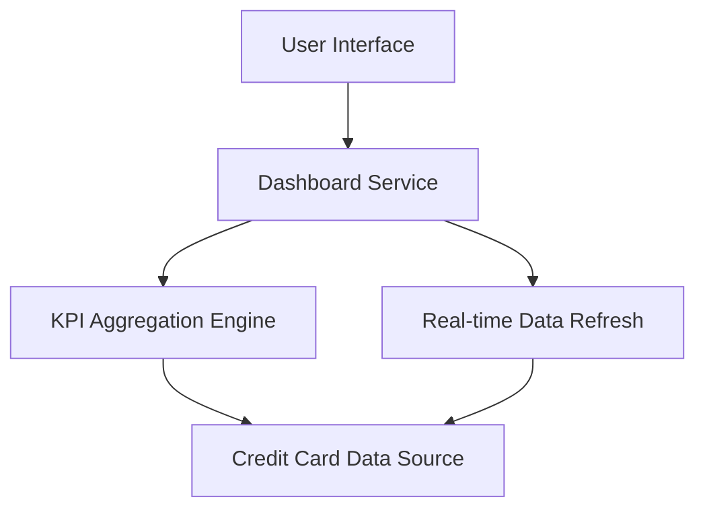

#### 1. High-Level Design

- **Summary**: This epic provides a consolidated, responsive dashboard displaying key credit card KPIs including monthly spend, total credit limit, available credit, and outstanding amounts across multiple cards. The dashboard offers real-time visibility into financial health and credit utilization with sub-2-second load times.

- **Component Flow**:

- **Integration Points**: 
  - Upstream: Credit card data source or mock data service for card information, transaction data, and balance updates
  - No downstream systems specified

- **Key Assumptions**: 
  - Credit card data source provides APIs for real-time balance and transaction data retrieval
  - KPI calculations (available credit, outstanding amounts) are performed server-side for consistency

- **NFR Highlights**: Dashboard must load within 2 seconds; Responsive design across desktop, tablet, and mobile devices required; Real-time data refresh capability

#### 2. Validation Report

- **Requirements Coverage**: The design addresses all scope items including dashboard KPIs display, monthly spend tracking, total credit limit aggregation, available credit calculation, outstanding amount monitoring, multiple credit card view, and responsive layout design. The component flow shows dedicated KPI aggregation engine for efficient calculation and caching of key metrics. The real-time data refresh component ensures up-to-date information. The 2-second load time NFR is achievable through proper caching, data aggregation, and optimized API calls. Responsive design requirement is addressed at the UI layer. Integration dependency on credit card data source is explicitly mapped in the architecture.