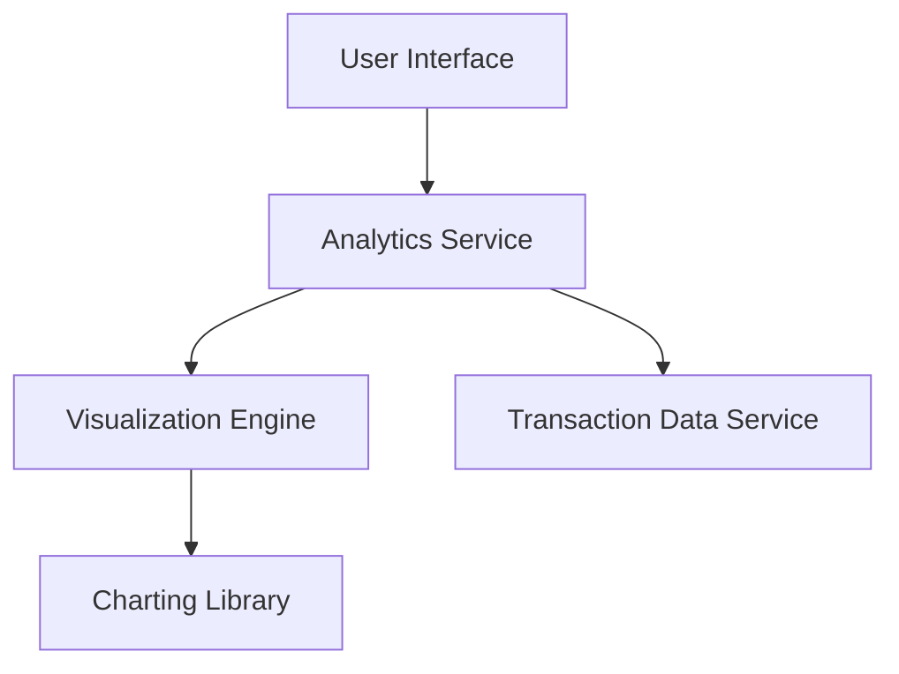

#### 1. High-Level Design

- **Summary**: This epic delivers interactive spending analytics across nine predefined categories (Food & Dining, Fuel, Shopping, Travel, Entertainment, Utilities, Healthcare, Education, Miscellaneous) with monthly trends and card-wise analysis. Users gain visual insights into spending patterns through interactive charts supporting 12 months of historical data.

- **Component Flow**:

- **Integration Points**: 
  - Upstream: Transaction data service for categorized spending information
  - Upstream: Charting library integration for interactive visualizations
  - No downstream systems specified

- **Key Assumptions**: 
  - Transaction data service provides pre-categorized transactions mapped to the nine predefined categories
  - Charting library supports drill-down and interactive features (e.g., Chart.js, D3.js, or similar)

- **NFR Highlights**: Visualization rendering must complete within 3 seconds; Charts must be interactive with drill-down capabilities; System must handle 12 months of historical data

#### 2. Validation Report

- **Requirements Coverage**: The design covers all scope requirements including category-wise spending visualization, monthly spend trends, card-wise analysis, interactive charts, and spending pattern identification across the nine predefined categories. The component flow demonstrates clear separation of concerns with dedicated analytics service and visualization engine. Integration dependencies on transaction data service and charting library are explicitly addressed. The 3-second rendering NFR is achievable with proper data aggregation and caching strategies. The 12-month historical data requirement is supported through the transaction data service layer.