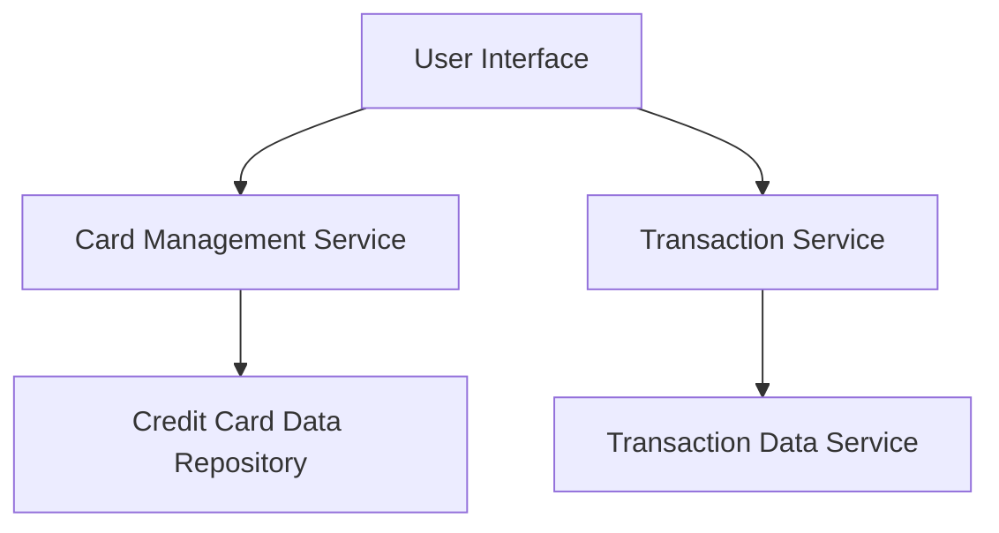

#### 1. High-Level Design

- **Summary**: This epic enables users to manage and view multiple credit cards (up to 10) within a single interface, providing card-specific details and comprehensive transaction history with filtering capabilities. The system consolidates multi-card management to eliminate the need for multiple banking app access.

- **Component Flow**:

- **Integration Points**: 
  - Upstream: Credit card data repository/service for card details
  - Upstream: Transaction data service for historical and current transaction records
  - No downstream systems specified

- **Key Assumptions**: 
  - Card and transaction data are available via RESTful APIs or similar service interfaces
  - Transaction filtering will support common criteria (date range, amount, merchant)

- **NFR Highlights**: System must support at least 10 credit cards per user; Transaction pagination required for large datasets; Card switching must be instantaneous with no perceivable lag

#### 2. Validation Report

- **Requirements Coverage**: The design addresses all stated scope items including multiple credit card display, card-specific details view, transaction history tracking, transaction listing/filtering, and card selection/switching interface. The component flow shows clear separation between card management and transaction services, supporting the epic's requirement for consolidated multi-card visibility. Integration points align with stated dependencies on credit card and transaction data services. NFRs for 10-card support, pagination, and instantaneous switching are technically feasible with proper caching and efficient data retrieval strategies.