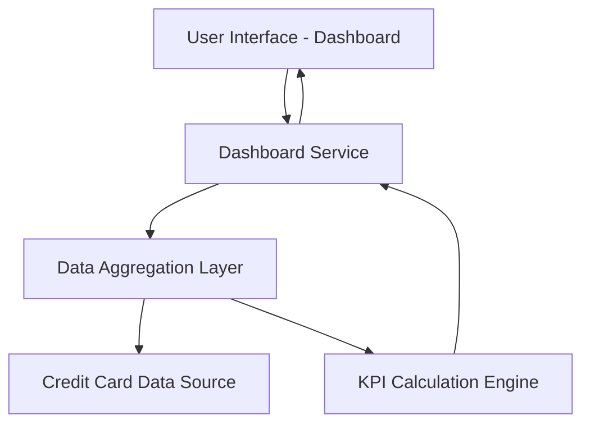

#### 1. High-Level Design

- **Summary**: This epic delivers a consolidated dashboard that displays key performance indicators (KPIs) for multiple credit cards in a single, responsive interface. Users can monitor monthly spend, total credit limit, available credit, and outstanding amounts across all their credit cards, providing a comprehensive financial overview. The dashboard must load within 2 seconds and support responsive design across desktop, tablet, and mobile devices.

- **Component Flow**:

- **Integration Points**: 
  - **Upstream**: Credit card data sources for retrieving card details, balances, and limits
  - **Downstream**: None explicitly mentioned in the epic

- **Key Assumptions**: 
  - Credit card data is available via API in JSON format with standardized fields for balance, limit, and spend
  - Dashboard refresh frequency is on-demand (user-initiated) rather than real-time push

- **NFR Highlights**: Dashboard must load within 2 seconds; System must support responsive design across desktop, tablet, and mobile devices; UI must be modern and intuitive

#### 2. Validation Report

- **Requirements Coverage**: The design covers all stated scope items including dashboard KPIs display, monthly spend tracking, total credit limit aggregation, available credit calculation, outstanding amount monitoring, multiple credit card view, and responsive layout design. The component flow addresses data retrieval from credit card data sources, aggregation of KPIs across multiple cards, calculation of derived metrics (available credit), and presentation through a responsive UI. All NFRs (2-second load time, responsive design, modern UI) are explicitly addressed in the architecture through dedicated components for data aggregation and KPI calculation to optimize performance.