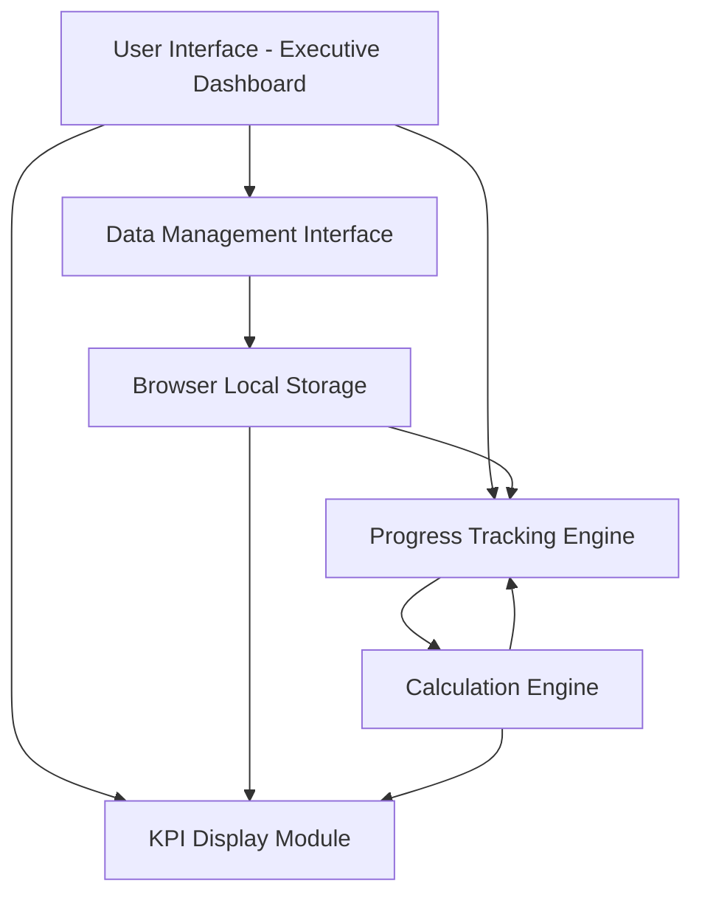

#### 1. High-Level Design

- **Summary**: This epic delivers the core Executive Testing Summary Dashboard with executive KPIs, testing use case progress, agent progress monitoring, workflow/APB flow tracking, and use case readiness visualization. It includes interactive progress bars with automatic percentage calculations and an editable data management system using browser-based persistence, covering all 12 testing scopes without requiring source code modification.

- **Component Flow**:

- **Integration Points**: Browser local storage for data persistence; Progress calculation engine for automatic percentage computation; Display rendering for all 12 testing scopes (Sprint, Regression, API, UI, Performance, Deployment, Roll Back, Backward Compatibility, Integration, Usability, Contract, Guardrail Testing).

- **Key Assumptions**: Progress data will be stored as completed/total counts per metric; Percentage calculations will round to nearest whole number for display clarity.

- **NFR Highlights**: Dashboard must load within 2 seconds under normal conditions; Must support desktop, tablet, and presentation-screen resolutions; Updated data must be retained after browser refresh using browser storage; Must maintain sufficient visual contrast for accessibility.

#### 2. Validation Report

- **Requirements Coverage**: The design covers all stated scope including Executive KPI tiles, Testing Use Case Progress, Overall Agents progress, Workflow Progress, APB Flow Progress, Use Case Readiness, progress bars with automatic calculations, editable data interface, browser persistence, and display of all 12 testing scopes. All NFRs (2-second load time, multi-device support, browser storage persistence, accessibility) are addressed through the modular architecture and calculation engine.