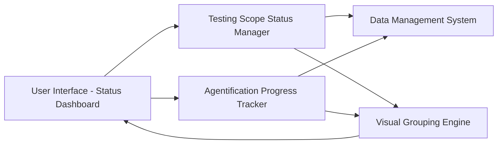

#### 1. High-Level Design

- **Summary**: This epic provides detailed visibility into testing scope status with clear categorization of "In Progress" and "Design in Progress" activities across 12 testing types. It tracks Agentification progress, displays ETAs for agentification activities, and provides visual grouping by status to enable monitoring of testing transformation and timeline alignment.

- **Component Flow**:

- **Integration Points**: Core dashboard data management system for status and ETA updates; Visual grouping engine for rendering status-based tile organization; Responsive display system for desktop, tablet, and presentation screens.

- **Key Assumptions**: ETA values will be manually entered by users in a standard date format; Agentification progress will be tracked as percentage completion per testing scope.

- **NFR Highlights**: Executive information must be understandable at a glance with minimal scrolling; Status indicators must maintain sufficient visual contrast for accessibility; Must support responsive display across desktop, tablet, and presentation screens.

#### 2. Validation Report

- **Requirements Coverage**: The design covers all 12 testing types with status tiles, In Progress and Design in Progress grouping, Agentification ETA display, agent progress tracking per scope, visual status indicators, and editable fields. All NFRs (at-a-glance readability, accessibility contrast, responsive display) are addressed through the visual grouping and display architecture.