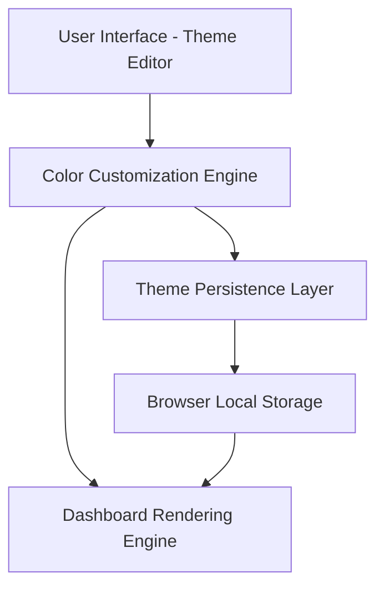

#### 1. High-Level Design

- **Summary**: This epic delivers a comprehensive theme editor enabling users to customize dashboard visual appearance for executive presentations without HTML code modification. It supports individual KPI and Testing Scope tile color customization, editable status colors, group background colors, bulk color application, and theme save/reset functionality with browser-based persistence.

- **Component Flow**:

- **Integration Points**: Browser local storage for theme persistence; Dashboard rendering engine for applying custom themes to KPI tiles, Testing Scope tiles, status indicators, and group backgrounds.

- **Key Assumptions**: Theme data structure will use JSON format stored in browser localStorage; Color values will be stored as hex codes or RGB values for consistent rendering across browsers.

- **NFR Highlights**: Theme changes must maintain sufficient visual contrast for accessibility; Dashboard must load within 2 seconds even with custom themes applied; Theme settings must be retained after browser refresh.

#### 2. Validation Report

- **Requirements Coverage**: The design covers all stated scope including Theme Editor interface, individual tile customization (KPI and Testing Scope), status color editing, group background customization, bulk color application, save/reset functionality, and theme persistence. All NFRs (accessibility contrast, 2-second load time, browser storage persistence, intuitive usability) are addressed through the component architecture.