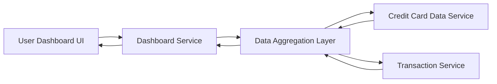

#### 1. High-Level Design

- **Summary**: This epic delivers a consolidated dashboard that displays key performance indicators (KPIs) for all user credit cards, including monthly spend, total credit limit, available credit, and outstanding amounts. The dashboard provides real-time financial metrics to enable informed decision-making and credit usage monitoring.

- **Component Flow**:

- **Integration Points**: 
  - **Upstream**: Credit Card Data Service (provides card details, balances, credit limits)
  - **Upstream**: Transaction Service (provides monthly spend calculations and transaction data)
  - **Downstream**: Dashboard UI (consumes aggregated KPI data)

- **Key Assumptions**: 
  - Real-time data refresh implies periodic polling or event-driven updates from backend services (frequency not specified, assume 30-60 second intervals)
  - Financial calculations use standard decimal precision for currency (2 decimal places) with proper rounding rules

- **NFR Highlights**: Dashboard load time <2 seconds; real-time data refresh capability; responsive UI across desktop/tablet/mobile; 100% accuracy for financial calculations

#### 2. Validation Report

- **Requirements Coverage**: The design addresses all stated scope items including monthly spend display, credit limit aggregation, available credit calculation, outstanding amount tracking, multi-card consolidated view, and responsive layout. The component flow demonstrates integration with required upstream services (Credit Card Data Service and Transaction Service) to aggregate and display KPIs. NFRs for performance (<2s load), responsiveness, and data accuracy are incorporated into the architecture through the Data Aggregation Layer and optimized service calls.