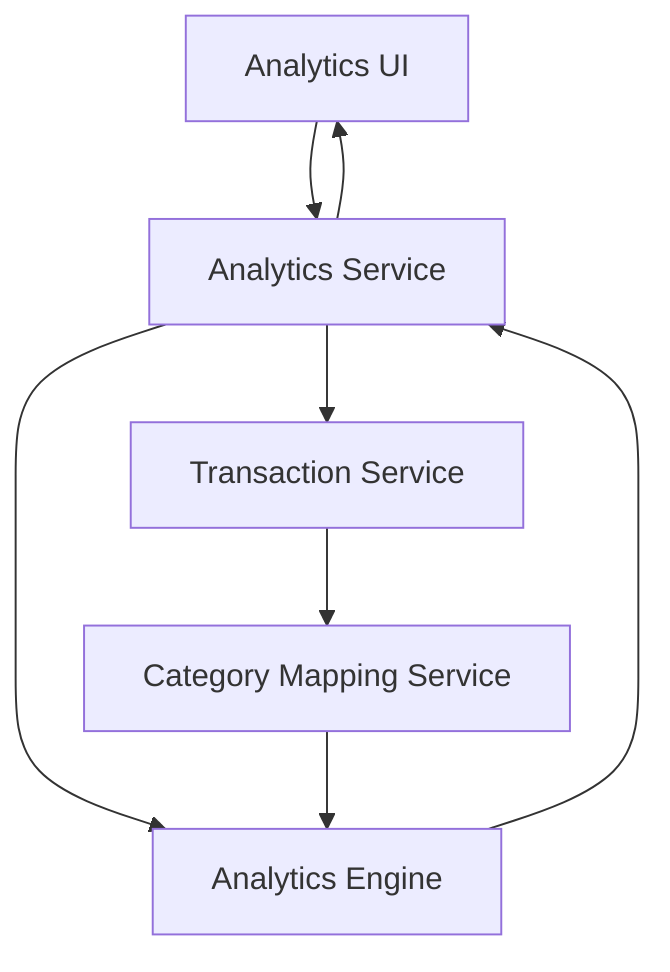

#### 1. High-Level Design

- **Summary**: This epic provides interactive visualizations that break down user spending across 9 predefined categories (Food & Dining, Fuel, Shopping, Travel, Entertainment, Utilities, Healthcare, Education, Miscellaneous). Users can interact with charts/graphs to drill down into specific categories and time periods for detailed spending analysis.

- **Component Flow**:

- **Integration Points**: 
  - **Upstream**: Transaction Service (provides transaction data with category mappings)
  - **Upstream**: Analytics Engine (performs data aggregation, computation, and category-wise analysis)
  - **Downstream**: Analytics UI (renders interactive charts and visualizations)

- **Key Assumptions**: 
  - Category mappings are pre-assigned to transactions by the Transaction Service or a separate categorization engine (logic for auto-categorization not specified)
  - Time period filtering defaults to current month with options for custom date ranges (specific filter options not detailed in epic)

- **NFR Highlights**: Visualization rendering <3 seconds; support for up to 10,000 transactions per user; interactive charts with drill-down; data aggregation accuracy to 2 decimal places

#### 2. Validation Report

- **Requirements Coverage**: The design covers all scope elements including category-wise spending visualization, interactive charts/graphs, breakdown across 9 predefined categories, time period filtering, and card-wise category analysis. The architecture integrates Transaction Service for raw data and Analytics Engine for aggregation/computation. NFRs for rendering performance (<3s), transaction volume (10K transactions), interactivity, and decimal precision are addressed through the Analytics Engine's processing capabilities and optimized data retrieval patterns.