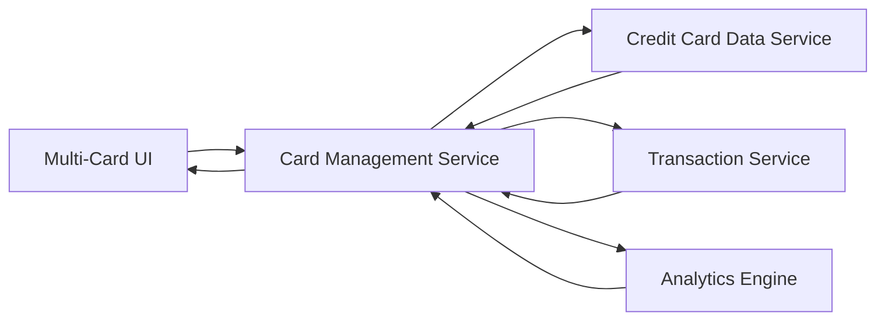

#### 1. High-Level Design

- **Summary**: This epic enables users to manage multiple credit cards (minimum 10 per user) within a unified interface, providing card-specific details, card switching capabilities, card-wise spending analysis, monthly spend trends visualization, and comprehensive transaction history tracking for each card.

- **Component Flow**:

- **Integration Points**: 
  - **Upstream**: Credit Card Data Service (provides card information, details, and metadata)
  - **Upstream**: Transaction Service (provides transaction records, history, and chronological data)
  - **Upstream**: Analytics Engine (performs trend analysis and card-wise spend calculations)
  - **Downstream**: Multi-Card UI (displays cards, transactions, and trends)

- **Key Assumptions**: 
  - Card switching uses client-side state management with cached data to achieve instantaneous switching without page reload
  - Transaction history pagination defaults to 20-50 transactions per page (page size not specified in epic)

- **NFR Highlights**: Support minimum 10 cards per user; pagination for large transaction datasets; instantaneous card switching without page reload; chronological transaction display

#### 2. Validation Report

- **Requirements Coverage**: The design fully addresses the epic scope including multiple credit card display, card-wise spend analysis, monthly spend trends visualization, transaction history tracking, card switching interface, and card-specific metrics. The architecture integrates all three required upstream services (Credit Card Data Service, Transaction Service, Analytics Engine) through the Card Management Service orchestration layer. NFRs for card capacity (10+ cards), pagination, instantaneous switching, and chronological ordering are incorporated through efficient data caching, client-side state management, and optimized query patterns.