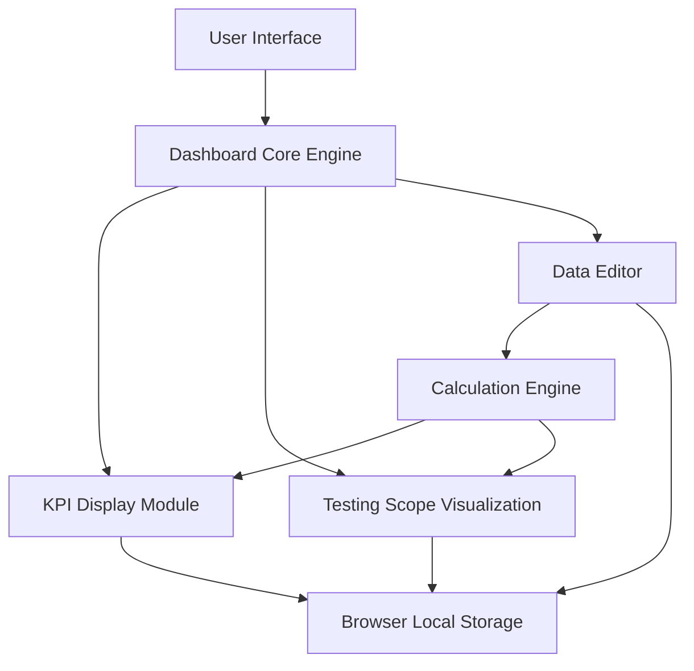

#### 1. High-Level Design

- **Summary:** This epic establishes the foundational Executive Testing Summary Dashboard providing comprehensive visibility into QE and testing program status. It includes display of executive KPIs, tracking of testing use cases, agent progress, workflow/APB flow completion, use case readiness, and status visualization across 12 testing types. The dashboard features automatic calculations, progress visualization, and an integrated data editor enabling users to update all dashboard data with browser-based persistence.

- **Component Flow:**

- **Integration Points:** 
  - Browser local storage for data persistence (no backend database in initial release)
  - No real-time ADO/Jira integration in initial release (explicitly out of scope)
  - Future integration points reserved for backend database and enterprise reporting systems

- **Key Assumptions:** 
  - Dashboard data updates are performed manually by authorized users through the Data Editor
  - Browser local storage provides sufficient reliability for the initial release without server-side backup

- **NFR Highlights:** Dashboard must load within 2 seconds under normal conditions; must support desktop, tablet, and common presentation-screen resolutions; updated dashboard data must be retained after browser refresh using browser storage; executive information must be understandable at a glance with minimal scrolling

#### 2. Validation Report

- **Requirements Coverage:** The design fully addresses all core functionality requirements including executive KPI display, comprehensive testing scope tracking across 12 testing types, progress monitoring for agents/workflows/APB flows, use case readiness indicators, status grouping, agentification ETA display, automatic percentage calculations, progress bars, and the integrated data editor with browser-based persistence. All in-scope items are covered through the modular architecture.

- **Gap Analysis:** No gaps for initial release. The explicit exclusion of backend database, authentication, and real-time integration is acknowledged and deferred to future phases. The browser-based storage approach is appropriate for the initial release scope.

- **Risk Assessment:** Medium risk. Primary risk is data loss if browser storage is cleared. Mitigation: implement export/import functionality for data backup (though export to PDF/Image is out of scope, JSON export/import could be considered). Performance target of 2 seconds is achievable with optimized rendering. The lack of authentication means access control must be managed at the deployment/hosting level.