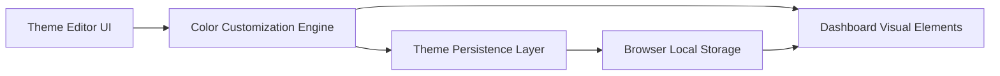

#### 1. High-Level Design

- **Summary:** This epic delivers a comprehensive theme customization system allowing users to personalize dashboard visual appearance for executive presentations and branding. Users can customize colors at multiple granularity levels (dashboard background, individual tiles, status groups, indicators), apply bulk color changes, save custom themes, and reset to defaults, with all preferences persisted in browser storage.

- **Component Flow:**

- **Integration Points:** 
  - Browser local storage API for theme persistence
  - Core dashboard functionality for applying theme changes to visual elements
  - Dashboard presentation layer for rendering customized colors

- **Key Assumptions:** 
  - Browser local storage capacity is sufficient for theme data (typically 5-10MB available, theme data <1KB)
  - Color selections will be validated for accessibility contrast ratios automatically or through user guidance

- **NFR Highlights:** Theme changes must be applied immediately without page reload; theme preferences must be retained after browser refresh; text, progress bars, status indicators, and backgrounds must maintain sufficient visual contrast for accessibility

#### 2. Validation Report

- **Requirements Coverage:** The design comprehensively covers all customization requirements including individual tile color customization, bulk color application across tile groups, status indicator and background color editing, theme save/reset functionality, and browser-based persistence. The Theme Editor UI provides the interface, while the Color Customization Engine handles the logic, and the Persistence Layer ensures continuity across sessions.

- **Gap Analysis:** No gaps identified. All in-scope items are addressed. The architecture supports immediate application of theme changes and persistent storage as required by NFRs.

- **Risk Assessment:** Low risk. Browser local storage is universally supported. The main consideration is ensuring accessibility compliance through contrast validation, which can be implemented using standard WCAG 2.1 contrast ratio calculations.