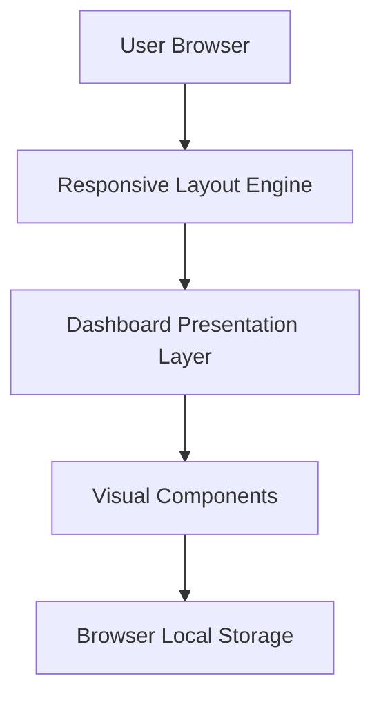

#### 1. High-Level Design

- **Summary:** This epic optimizes the executive dashboard for presentation and consumption scenarios by implementing responsive design across multiple device formats (desktop, tablet, presentation screens), ensuring sub-2-second load performance, and creating an intuitive visual hierarchy that enables at-a-glance comprehension of testing program health without excessive scrolling.

- **Component Flow:**

- **Integration Points:** 
  - Browser rendering engine for responsive layout adaptation
  - Core dashboard functionality for data display and rendering
  - Theme customization system for visual presentation consistency

- **Key Assumptions:** 
  - Normal network conditions are defined as stable broadband connectivity with <100ms latency
  - "Minimal scrolling" is interpreted as primary executive information visible within one viewport height

- **NFR Highlights:** Dashboard must load within 2 seconds under normal conditions; must support desktop, tablet, and common presentation-screen resolutions; must maintain accessibility-compliant visual contrast ratios

#### 2. Validation Report

- **Requirements Coverage:** The design fully addresses the epic's stated scope including responsive design for multiple form factors, performance optimization targeting sub-2-second load times, executive-focused information architecture with minimal scrolling, visual hierarchy implementation through progress bars and status groupings, and accessibility-compliant visual contrast. All in-scope items are covered through the responsive layout engine and presentation layer components.

- **Gap Analysis:** No significant gaps identified. The design covers all functional requirements. NFRs are measurable and achievable through standard web optimization techniques (lazy loading, efficient rendering, CSS optimization).

- **Risk Assessment:** Low risk. Technologies required (responsive CSS, browser rendering optimization) are mature and well-supported. Performance target of 2 seconds is achievable with proper optimization.