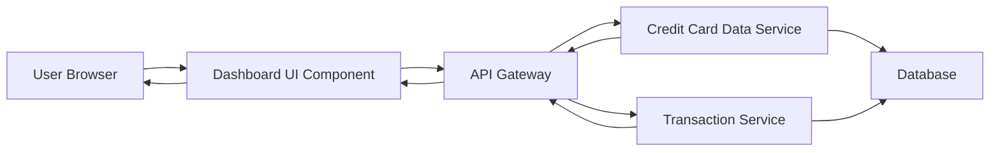

#### 1. High-Level Design

- **Summary:** This epic delivers a consolidated dashboard that displays key performance indicators (KPIs) for all user credit cards, including monthly spend, total credit limit, available credit, and outstanding amounts. The dashboard provides a responsive, accessible interface for users to monitor their credit card portfolio and financial health across multiple devices.

- **Component Flow:**

- **Integration Points:** 
  - **Upstream:** Credit Card Data Service (retrieves card details, balances, and limits)
  - **Upstream:** Transaction Service (calculates monthly spend and outstanding amounts)
  - **Downstream:** User interface components (mobile, tablet, desktop viewports)

- **Key Assumptions:** 
  - KPI data is refreshed in near real-time or at regular intervals (e.g., every few minutes) to ensure accuracy.
  - Credit card data and transaction data are available via RESTful APIs with standard JSON response formats.

- **NFR Highlights:** Dashboard must load within 2 seconds; System must support responsive design for mobile, tablet, and desktop viewports; UI must be accessible and meet WCAG 2.1 standards.

#### 2. Validation Report

- **Requirements Coverage:** The design covers all stated requirements including KPI display (Monthly Spend, Total Credit Limit, Available Credit, Outstanding Amount), multiple credit card view, consolidated overview, and responsive layout. The architecture supports the 2-second load time requirement through efficient API calls and caching strategies. Accessibility standards (WCAG 2.1) will be implemented in the UI component layer.

- **Completeness:** All in-scope items are addressed. Out-of-scope items (real bank integration, card payments, fund transfers, loans, payment gateway integration) are explicitly excluded and not part of this design.

- **Traceability:** Each component maps directly to epic requirements: Dashboard UI Component handles responsive layout and KPI display; Credit Card Data Service provides card details; Transaction Service calculates financial metrics; API Gateway ensures secure, performant data retrieval within NFR constraints.