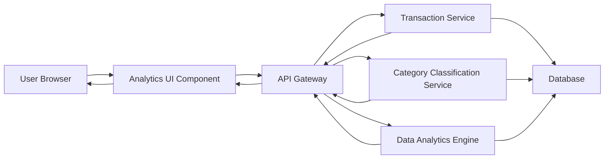

#### 1. High-Level Design

- **Summary:** This epic provides interactive analytics capabilities enabling users to visualize and analyze their credit card spending across multiple dimensions. Users can view category-wise spending breakdowns (9 categories: Food & Dining, Fuel, Shopping, Travel, Entertainment, Utilities, Healthcare, Education, Miscellaneous), monthly spend trends, and card-wise spend analysis through interactive charts and graphs.

- **Component Flow:**

- **Integration Points:**
  - **Upstream:** Transaction Service (retrieves transaction data for analysis)
  - **Upstream:** Category Classification Service (categorizes transactions into 9 predefined categories)
  - **Upstream:** Data Analytics Engine (performs trend analysis and aggregations)
  - **Downstream:** Interactive charting library (renders visualizations with drill-down capabilities)

- **Key Assumptions:**
  - Transaction data includes pre-assigned categories or can be classified in real-time with acceptable performance.
  - Analytics calculations (aggregations, trends) are performed server-side to handle up to 10,000 transactions per user efficiently.

- **NFR Highlights:** Analytics visualizations must render within 1.5 seconds; System must handle up to 10,000 transactions per user for analysis; Charts must be interactive and support drill-down capabilities.

#### 2. Validation Report

- **Requirements Coverage:** The design addresses all functional requirements including category-wise spending visualization across 9 categories, monthly spend trends, card-wise spend analysis, and interactive charts. The architecture supports the 1.5-second rendering requirement through optimized data aggregation and caching. The Data Analytics Engine handles large transaction volumes (up to 10,000 per user) with efficient query processing.

- **Completeness:** All in-scope analytics features are covered. Out-of-scope items (real bank integration, predictive analytics, budget recommendations, alerts and notifications) are explicitly excluded from this design.

- **Traceability:** Each component directly supports epic requirements: Analytics UI Component provides interactive visualizations; Transaction Service supplies raw transaction data; Category Classification Service enables category-wise analysis; Data Analytics Engine computes trends and aggregations; all components work together to meet the 1.5-second NFR.