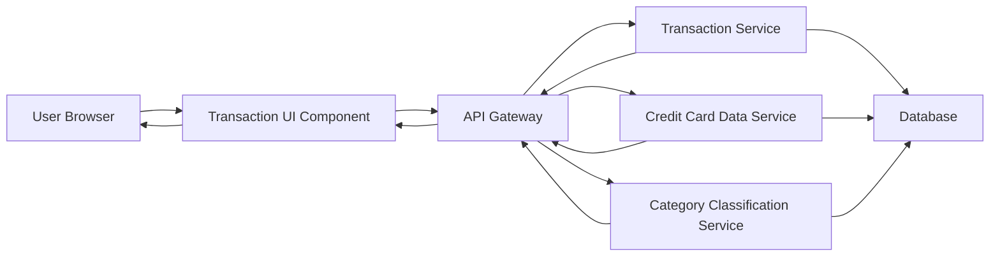

#### 1. High-Level Design

- **Summary:** This epic delivers comprehensive transaction management capabilities allowing users to view, search, filter, and sort credit card transactions across all their cards. Users can access detailed transaction history including merchant information, amounts, dates, and categories, with support for filtering by date range, card, and category. The system provides pagination for large transaction sets and fast search functionality.

- **Component Flow:**

- **Integration Points:**
  - **Upstream:** Transaction Service (retrieves transaction data with search and filter capabilities)
  - **Upstream:** Credit Card Data Service (links transactions to specific credit cards)
  - **Upstream:** Category Classification Service (provides transaction categorization)
  - **Downstream:** UI pagination and search components (handles large transaction sets efficiently)

- **Key Assumptions:**
  - Transaction data is indexed for fast search and filtering operations to meet the 500ms search response time.
  - Pagination is implemented with cursor-based or offset-based approach to handle large transaction volumes efficiently.

- **NFR Highlights:** Transaction list must load within 2 seconds for up to 1,000 transactions; System must support pagination for large transaction sets; Search functionality must return results within 500ms.

#### 2. Validation Report

- **Requirements Coverage:** The design covers all functional requirements including transaction listing and display, search and filtering, multi-card transaction view, transaction details (merchant, amount, date, category), and sort/filter capabilities. The architecture supports the 2-second load time for 1,000 transactions through pagination and efficient data retrieval. Search functionality meets the 500ms requirement through database indexing and optimized queries.

- **Completeness:** All in-scope transaction management features are addressed. Out-of-scope items (transaction editing or deletion, dispute management, receipt uploads, transaction notes, export functionality) are explicitly excluded from this design.

- **Traceability:** Each component maps to epic requirements: Transaction UI Component handles display, search, and filtering; Transaction Service provides core transaction data retrieval; Credit Card Data Service links transactions to cards; Category Classification Service enables category-based filtering; pagination and indexing strategies ensure NFR compliance.